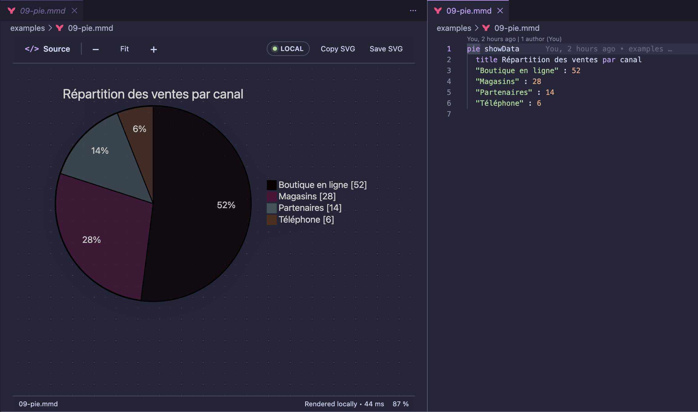
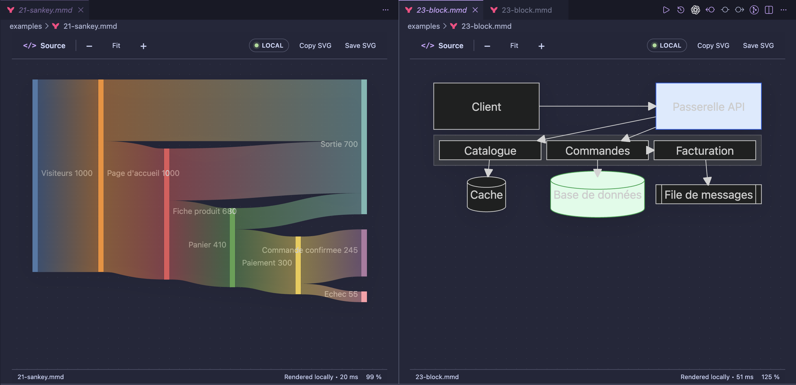
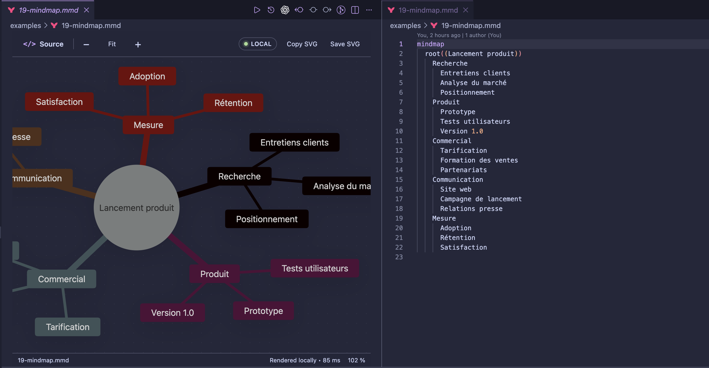
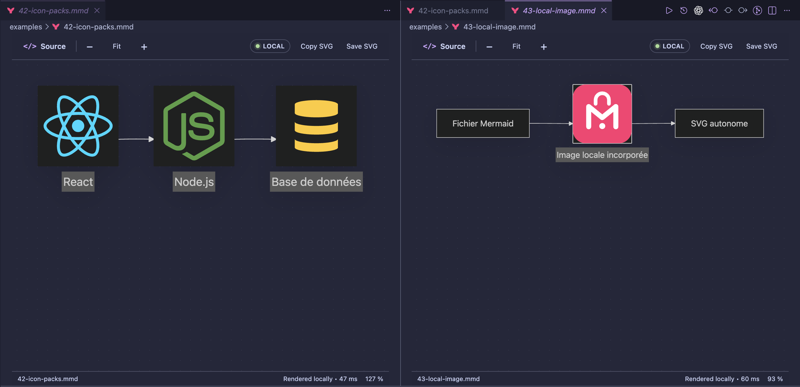

<p align="center">
  
</p>

<h1 align="center">Mermaid Preview — 100% Offline</h1>

<p align="center">
  A fast, private Mermaid preview built into VS Code.<br>
  No account. No cloud. No telemetry.
</p>

<p align="center">
  <a href="https://marketplace.visualstudio.com/items?itemName=brainfkt.mermaid-preview-offline"></a>
  
  
  <a href="https://github.com/Brainfkt/mermaid-preview-offline/actions/workflows/ci.yml"></a>
</p>

<p align="center">
  <a href="https://marketplace.visualstudio.com/items?itemName=brainfkt.mermaid-preview-offline"><strong>Install from the Marketplace</strong></a>
  ·
  <a href="examples/README.md">Browse 43 examples</a>
  ·
  <a href="examples/COMPATIBILITY.md">Compatibility matrix</a>
</p>



<p align="center"><em>Edit the source and see the locally rendered preview update beside it.</em></p>

Open any `.mmd` or `.mermaid` file and the diagram appears immediately in a
native VS Code editor. Select **Source** to keep the Mermaid code beside the
preview while you work. The renderer, plug-ins, icons, and supported local
assets all ship inside the extension.

## Why use it?

| | Capability | What it gives you |
|---|---|---|
| ⚡ | **Instant preview** | Mermaid files open directly in a polished live preview. |
| 🔒 | **Private by design** | Diagram source never leaves your machine. |
| 📴 | **Truly offline** | No CDN, API, account, sign-in, or network dependency. |
| 🔍 | **Comfortable navigation** | Fit, zoom, and drag across large diagrams. |
| ⇩ | **Portable SVG output** | Copy the SVG or save it as a standalone file. |
| ◇ | **Broad Mermaid coverage** | Core diagrams, experimental families, ZenUML, icons, and local images. |

## Made for VS Code workflows

Keep several Mermaid previews open in normal VS Code editor groups. Each view
has its own zoom level and exposes rendering time, zoom percentage, and local
rendering status in the footer.



Large diagrams remain easy to inspect with fit-to-window, incremental zoom, and
drag-to-pan navigation. Select **Source** whenever you want the document and its
preview visible at the same time.



## Bundled assets work offline too

The official ZenUML plug-in and the Iconify `logos` and
`material-icon-theme` collections are registered from the local bundle. Relative
images inside the workspace are converted to `data:` URIs, so exported SVGs stay
portable and do not depend on local file paths.



## Get started

1. Install **Mermaid Preview — 100% Offline** from the
   [VS Code Marketplace](https://marketplace.visualstudio.com/items?itemName=brainfkt.mermaid-preview-offline).
2. Open a `.mmd` or `.mermaid` file from the Explorer.
3. Select **Source** or press `E` to edit beside the live preview.
4. Use **Copy SVG** or **Save SVG** when the diagram is ready.

No configuration is required. To temporarily open a Mermaid file as plain text,
use **Reopen Editor With...** → **Text Editor**.

## Features

- Live rendering whenever the document changes.
- Readable syntax errors with a direct path back to the source.
- Fit-to-window, incremental zoom, and drag-to-pan navigation.
- SVG copy and file export.
- Dark, light, and high-contrast VS Code theme support.
- Mermaid syntax highlighting for `.mmd` and `.mermaid` files.
- Mermaid `11.16.0` bundled and pinned for reproducible rendering.
- Official `@mermaid-js/mermaid-zenuml` plug-in bundled locally.
- Iconify `logos` and `material-icon-theme` packs bundled locally.
- Relative SVG, PNG, JPEG, GIF, WebP, AVIF, BMP, and ICO images embedded as
  data URIs.
- No telemetry, analytics, remote fonts, or runtime downloads.

## Diagram coverage

The extension includes validated examples for more than 40 Mermaid diagram
families and capabilities, including:

| General | Software design | Planning and data | Experimental |
|---|---|---|---|
| Flowchart | Sequence | Gantt | Architecture |
| Mindmap | Class | Git graph | Kanban |
| Timeline | State | Journey | Sankey |
| Pie and donut | Entity relationship | Requirement | XY and radar charts |
| Quadrant | C4 | Packet | Treemap and Wardley Map |
| Venn | ZenUML | Event Modeling | Railroad and swimlanes |

See the [complete example catalogue](examples/README.md) and the
[compatibility matrix](examples/COMPATIBILITY.md) for exact keywords, stability,
and current limitations.


## Controls

| Control | Action |
|---|---|
| `E` | Open the source beside the preview |
| `Ctrl/Cmd + 0` | Fit the diagram to the viewport |
| `+` / `-` | Zoom in or out |
| `Ctrl/Cmd + mouse wheel` | Fine zoom control |
| Drag | Pan across the canvas |
| **Copy SVG** | Copy the rendered SVG to the clipboard |
| **Save SVG** | Save the rendered diagram as an SVG file |

## Privacy and security

Rendering happens inside a restricted VS Code webview. The extension:

- blocks network connections with `connect-src 'none'`;
- loads executable resources only from the installed VSIX;
- runs Mermaid with `securityLevel: strict`;
- contains no telemetry or analytics;
- rejects absolute image paths and paths outside the workspace;
- writes outside the current document only after an explicit **Save SVG** action.

## Install from a VSIX

1. Download the latest package from
   [GitHub Releases](https://github.com/Brainfkt/mermaid-preview-offline/releases/latest).
2. In VS Code, open **Extensions**.
3. Choose `...` → **Install from VSIX...** and select the downloaded file.

## Development

Requires Node.js 22 and npm.

```bash
npm ci
npm run verify
npm run package:vsix
```

The VSIX is generated in `artifacts/`. To debug the extension, open the
repository in VS Code and launch **Run Mermaid Preview Offline** with `F5`.

## Support

Found a bug or have an idea? Open a
[GitHub issue](https://github.com/Brainfkt/mermaid-preview-offline/issues).

## License and attribution

This extension is released under the [MIT License](LICENSE). Mermaid and the
Mermaid logo are used from the
[mermaid-js/mermaid](https://github.com/mermaid-js/mermaid) project under its MIT
license. See [third-party notices](THIRD_PARTY_NOTICES.md) for ZenUML and icon
pack attribution.

This is an independent community extension and is not affiliated with or
endorsed by Mermaid Chart.
