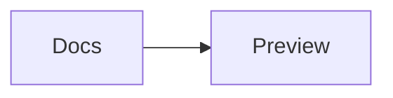

<p align="center">
  
</p>

<h1 align="center">Mermaid Preview Offline</h1>

<p align="center">
  A fast, private Mermaid preview built into VS Code.<br>
  No account. No cloud. No telemetry.
</p>

<p align="center">
  <a href="https://marketplace.visualstudio.com/items?itemName=brainfkt.mermaid-preview-offline"></a>
  
  
  <a href="https://github.com/Brainfkt/mermaid-preview-offline/actions/workflows/ci.yml"></a>
</p>

<p align="center">
  <a href="https://marketplace.visualstudio.com/items?itemName=brainfkt.mermaid-preview-offline"><strong>Install from the Marketplace</strong></a>
  ·
  <a href="https://github.com/Brainfkt/mermaid-preview-offline/blob/main/docs/USER_GUIDE.md">User guide</a>
  ·
  <a href="https://github.com/Brainfkt/mermaid-preview-offline/blob/main/examples/README.md">Browse 44 examples</a>
  ·
  <a href="https://github.com/Brainfkt/mermaid-preview-offline/blob/main/examples/COMPATIBILITY.md">Compatibility matrix</a>
  ·
  <a href="https://github.com/Brainfkt/mermaid-preview-offline/blob/main/roadmap.md">Roadmap</a>
</p>


<p align="center"><em>Render complete Mermaid diagrams locally with native VS Code controls, themes, and export tools.</em></p>

Open any `.mmd` or `.mermaid` file and the diagram appears immediately in a
native VS Code editor. Use the layout control to switch between preview-only,
source-only, source beside preview, and source above preview. The renderer,
plug-ins, icons, and supported local assets all ship inside the extension.
Mermaid blocks embedded in Markdown, MDX, and AsciiDoc can be previewed one at
a time or together in a live document view.

## Why use it?

| | Capability | What it gives you |
|---|---|---|
| ⚡ | **Instant preview** | Mermaid files open directly in a polished live preview. |
| ✎ | **Advanced editing** | Problems, quick fixes, completion, snippets, formatting, and safe refactors. |
| 🔒 | **Private by design** | Diagram source never leaves your machine. |
| 📴 | **Truly offline** | No CDN, API, account, sign-in, or network dependency. |
| 🔍 | **Comfortable navigation** | Fit, zoom, and drag across large diagrams. |
| ⇩ | **Professional export** | Preview and export PNG, WebP, PDF, or portable SVG files. |
| ▤ | **Documentation workflows** | Render embedded Mermaid blocks and export documents with local images. |
| ◇ | **Broad Mermaid coverage** | Core diagrams, experimental families, ZenUML, icons, and local images. |

## Made for VS Code workflows

Keep several Mermaid previews open in normal VS Code editor groups. Each view
has its own zoom level and exposes file size, natural diagram dimensions,
rendering time, and zoom percentage in the footer. Zoom and scroll position are
restored per preview after VS Code restarts, while the selected diagram theme
and editor layout stay synchronized across files. Choose **Preview only**,
**Source only**, **Beside**, or **Above** from the preview toolbar. Beside and
Above use VS Code's real text editor, so completion, formatting, snippets, quick
fixes, and diagnostics remain available. Their native group ratio is restored
per file. Selecting another Mermaid source tab immediately replaces the
companion preview, while the extension keeps a single source/preview pair for
the active document. With the preview focused, press `P` repeatedly to cycle
through Preview only, Beside, and Above. Use `Alt+P` from the Mermaid source
editor (`Option+P` on macOS), so plain `P` remains available for typing. Clicking
the canvas or minimap focuses the preview, and focus follows every layout
transition.

<p align="center">
  
</p>

<p align="center"><em>Switch between the four native editor layouts without leaving the preview.</em></p>


Large diagrams remain easy to inspect with fit-to-window, incremental zoom,
drag-to-pan navigation, and a draggable minimap that appears only when the
diagram exceeds the viewport. The active editor group can be maximized without
losing the selected layout. Press `/` or `Ctrl/Cmd+F` to find labels inside the
rendered diagram, click a rendered node to reveal its source line, or use the
pop-out button to copy the live preview into a separate VS Code window while
keeping the original visible.


## Bundled assets work offline too

The official ZenUML and tidy-tree layout plug-ins and the Iconify `logos`,
`mdi`, and `material-icon-theme` collections are bundled locally and loaded
only when a diagram uses them. Relative images inside the workspace are
converted to `data:` URIs, so exported SVGs stay portable and do not depend on
local file paths.

<p align="center">
  
  
</p>

<p align="center"><em>Bundled Iconify packs and workspace-relative images render without a network request.</em></p>

## Classic and modern diagram themes

Choose **Adaptive**, **Default**, **Dark**, **Forest**, **Neutral**, **Base**,
**Neo**, **Neo Dark**, **Vibrant**, **Vibrant Dark**, or **Sketch** from the
visual appearance gallery. Adaptive and Sketch choose their light or dark
palette from the canvas itself. Select Compact, Comfortable, or Spacious
density, then pick a VS Code, light, dark, or custom background with no pattern,
dots, or a grid. The canvas choice is independent from the VS Code color theme.


## Diagram typography

Diagram text follows VS Code's interface font by default, using
`--vscode-font-family` in previews and a matching system UI fallback where that
variable is unavailable. Set `mermaidPreviewOffline.diagramFontFamily` to
`noto-sans` or `inter` when you want identical Latin and Latin Extended glyphs
and metrics across platforms. Both optional fonts are bundled locally; no font
is fetched at runtime.

The VS Code choice keeps diagrams visually consistent with the current editor,
but its exact typeface can vary between machines. Noto Sans and Inter are the
portable choices for optimized SVG, PNG, WebP, and PDF exports because their
font data ships with the output rendering path. Original SVG remains Mermaid's
unchanged output and does not receive export-time font embedding.

## Get started

1. Install **Mermaid Preview — 100% Offline** from the
   [VS Code Marketplace](https://marketplace.visualstudio.com/items?itemName=brainfkt.mermaid-preview-offline).
2. Open a `.mmd` or `.mermaid` file from the Explorer.
3. Select the layout control and choose **Source**, **Beside**, or **Above** to
   edit in VS Code's native Mermaid editor.
4. Use **Export** to preview the final result, tune its output profile, and save
   PNG, WebP, PDF, or SVG.

No configuration is required. To temporarily open a Mermaid file as plain text,
use **Reopen Editor With...** → **Text Editor**.

## Professional export

Inspect the exact output before saving it, then configure format, export theme,
scale, DPI, margin, background, metadata, optimization, and file-name tokens.
Reusable profiles keep documentation and release exports consistent across
workspaces.

The toolbar's **Copy SVG** action places the current original vector diagram on
the clipboard without opening the export dialog.


## Features

- Live rendering whenever the document changes.
- Automatic or manual refresh, with a configurable render delay.
- Readable syntax errors with a direct path back to the source.
- Error locations with line, column, source excerpt, and a Retry action.
- Native Problems diagnostics and editor underlines powered by bundled Mermaid.
- Quick fixes for common declaration typos, Unicode arrows, missing block ends,
  and missing node identifiers.
- Keyword completion, contextual hover help, and 43 diagram-family snippets.
- Formatting, node/link insertion, missing-ID generation, and rename support.
- Four workspace-persistent native layouts: Preview, Source, Beside, and Above.
- Per-file native split proportions with full completion and formatting support.
- Beside and Above follow the active Mermaid source without duplicate previews.
- Fit-to-window, incremental zoom, drag-to-pan, and an optional minimap.
- Exact UTF-8 file size and natural rendered diagram dimensions in the footer.
- Eleven workspace-wide classic and modern appearances in a visual gallery.
- Independent canvas colors, custom backgrounds, dots/grid patterns, and three
  diagram densities shared by preview, Studio, diffs, documentation, and export.
- In-diagram search and click-to-source navigation for rendered elements.
- Documentation presentation mode and preview pop-out to a new VS Code window.
- VS Code-native diagram typography by default, with offline Noto Sans and
  Inter presets for portable exports and complete Latin accents.
- A modern glass interface that remains native to VS Code themes.
- Live export preview with reusable profiles.
- PNG, WebP, PDF, optimized SVG, and original SVG export.
- Direct PNG clipboard copy, recursive folder export, and a task-ready offline CLI.
- Configurable DPI, scale, margin, transparent or colored background, export
  theme, metadata, and file name templates.
- Diagram Studio with eight customizable templates and all 44 bundled examples.
- Local SQL-schema generation of Mermaid entity-relationship diagrams.
- Local `package.json` dependency-graph generation.
- Rendered Git comparisons with side-by-side and color-coded overlay views.
- Preview the Mermaid block under the cursor in Markdown, MDX, or AsciiDoc.
- Render every Mermaid block in a live document view with independent pan,
  pointer-centered zoom, trackpad pinch, source navigation, and restored state.
- Resize documentation diagrams vertically and cap their height through settings.
- Recognize fenced and `::: mermaid` Markdown/MDX blocks, with configurable
  Mermaid language identifiers.
- Export documentation copies that replace Mermaid blocks with local SVG or PNG images.
- Dark, light, and high-contrast VS Code theme support.
- Mermaid syntax highlighting for `.mmd` and `.mermaid` files.
- Mermaid `11.16.0` bundled and pinned for reproducible rendering.
- Official `@mermaid-js/mermaid-zenuml` plug-in bundled locally.
- Iconify `logos`, `mdi`, and `material-icon-theme` packs bundled locally.
- Tidy-tree mindmap layout bundled locally.
- Relative SVG, PNG, JPEG, GIF, WebP, AVIF, BMP, and ICO images embedded as
  data URIs.
- No telemetry, analytics, remote fonts, or runtime downloads.
- Fixed memory guardrails for very large sources, local-image sets, and raster
  exports, with actionable messages instead of unbounded work.
- A single, optional Marketplace review prompt only after five successful
  preview sessions—never after every edit or render.
- Adaptive handling for large files and cancellation of obsolete renders.
- Workspace-aware local assets in multi-root and remote workspaces.

## Mermaid-aware editing

The native text editor provides declaration completion, contextual help,
snippets, diagnostics, quick fixes, formatting, node insertion, missing-ID
generation, and safe identifier rename without replacing VS Code's editor.

<p align="center">
  
</p>

## Diagram coverage

The extension includes validated examples for more than 40 Mermaid diagram
families and capabilities, including:

| General | Software design | Planning and data | Experimental |
|---|---|---|---|
| Flowchart | Sequence | Gantt | Architecture |
| Mindmap | Class | Git graph | Kanban |
| Timeline | State | Journey | Sankey |
| Pie and donut | Entity relationship | Requirement | XY and radar charts |
| Quadrant | C4 | Packet | Treemap and Wardley Map |
| Venn | ZenUML | Event Modeling | Railroad and swimlanes |

See the [complete example catalogue](https://github.com/Brainfkt/mermaid-preview-offline/blob/main/examples/README.md) and the
[compatibility matrix](https://github.com/Brainfkt/mermaid-preview-offline/blob/main/examples/COMPATIBILITY.md) for exact keywords, stability,
and current limitations.


## Controls

| Control | Action |
|---|---|
| `E` | Switch to Source-only mode |
| **Editor layout** | Choose Preview, Source, Beside, or Above |
| Explorer context menu | Open the selected Mermaid file in any of the four layouts |
| Drag the native group separator | Resize source and preview; the ratio is stored per file |
| **Open in new window** | Copy the live preview into a separate VS Code window while keeping the original visible |
| Minimap | Click or drag to navigate an overflowing diagram |
| `R` | Refresh the diagram |
| `Ctrl/Cmd + 0` | Fit the diagram to the viewport |
| `+` / `-` | Zoom in or out |
| `Ctrl/Cmd` or `Alt/Option` + mouse wheel | Pointer-centered zoom and trackpad pinch |
| `Alt/Option` + click; add `Shift` | Zoom in; zoom out with `Shift` |
| Drag | Pan according to the configured mouse policy |
| **Copy SVG** | Copy the current original rendered SVG to the clipboard |
| **Export** | Preview and save PNG, WebP, PDF, optimized SVG, or original SVG |
| Export dialog | Copy PNG/original SVG/optimized SVG, save profiles, or export a folder |

## Settings

| Setting | Default | Purpose |
|---|---|---|
| `mermaidPreviewOffline.refreshMode` | `automatic` | Switch between live and manual rendering. |
| `mermaidPreviewOffline.refreshDelay` | `140` | Set the automatic refresh delay in milliseconds. |
| `mermaidPreviewOffline.largeFileThresholdKb` | `512` | Apply the large-file render policy above this size. |
| `mermaidPreviewOffline.minimap.enabled` | `true` | Show the minimap when the diagram exceeds the viewport. |
| `mermaidPreviewOffline.navigation.mouse` | `always` | Pan directly with `always`, require Alt/Option with `alt`, or disable direct panning with `never`. |
| `mermaidPreviewOffline.navigation.controls` | `always` | Show controls `always`, `onHoverOrFocus`, or `never`. |
| `mermaidPreviewOffline.documentation.languages` | `["mermaid"]` | Recognize additional exact Markdown/MDX block language identifiers. |
| `mermaidPreviewOffline.documentation.resizable` | `true` | Allow vertical resizing of documentation diagram cards. |
| `mermaidPreviewOffline.documentation.maxHeight` | empty | Cap documentation cards with a validated CSS length such as `720px` or `80vh`. |
| `mermaidPreviewOffline.diagramTheme` | `adaptive` | Choose a theme shared by every preview in the workspace. |
| `mermaidPreviewOffline.diagramFontFamily` | `vscode` | Follow VS Code's font, or use bundled Noto Sans/Inter for portable output. |
| `mermaidPreviewOffline.export.format` | `png` | Choose the default professional export format. |
| `mermaidPreviewOffline.export.theme` | `default` | Render exports with a theme independent from the preview. |
| `mermaidPreviewOffline.export.scale` | `1` | Set the default export scale factor. |
| `mermaidPreviewOffline.export.dpi` | `144` | Set raster and PDF resolution. |
| `mermaidPreviewOffline.export.margin` | `24` | Add space around the exported diagram. |
| `mermaidPreviewOffline.export.background` | `transparent` | Choose a transparent or colored background. |
| `mermaidPreviewOffline.export.backgroundColor` | `#ffffff` | Set the color used when the export background is `color`. |
| `mermaidPreviewOffline.export.fileNameTemplate` | `{name}-{theme}@{scale}x.{format}` | Build output names from export tokens. |
| `mermaidPreviewOffline.export.optimizeSvg` | `true` | Optimize SVG before saving or rasterizing it. |
| `mermaidPreviewOffline.export.includeMetadata` | `false` | Opt in to source and export metadata; keep it off for reproducible optimized SVG. |

The Mermaid file context menu exposes all four layouts. **Mermaid Preview:
Configure Default Editor** switches `.mmd` and `.mermaid` files between the
offline preview and VS Code's text editor.
In a Mermaid text editor, use **Mermaid: Insert Node or Link**, **Mermaid:
Generate Missing Identifiers**, **Mermaid: Rename Identifier**, or **Mermaid:
Format Document** from the Command Palette or editor context menu.

## Built-in resource safeguards

| Resource | Limit | What happens at the limit |
|---|---:|---|
| Mermaid source | 10 MiB of UTF-8 source | Preview rendering pauses with the measured size and limit; CLI and batch rendering reject that file. The source remains editable. |
| Local images in one diagram | 64 unique images, 8 MiB each, 24 MiB combined | Rendering stops with a message identifying the image-count, per-image, or aggregate limit. |
| PNG, WebP, and PDF rasterization | 32,000,000 pixels | Export stops before allocating the oversized canvas and asks you to reduce scale or DPI. SVG remains available. |

These fixed limits keep memory use predictable. Optimize or split large images,
split unusually large diagrams, or reduce export scale/DPI rather than retrying
the same oversized operation.

## Command reference


| Command Palette title | Purpose |
|---|---|
| **Mermaid Preview: Open Offline Preview** | Open the current Mermaid file in the offline custom editor. |
| **Mermaid Preview: Open Preview to the Side** | Keep the current editor visible and open its preview beside it. |
| **Mermaid Preview: Choose Editor Layout** | Select Preview only, Source only, Beside, or Above. |
| **Mermaid Preview: Preview Only** | Show only the rendered diagram. |
| **Mermaid Preview: Source Only** | Show only VS Code's native Mermaid editor. |
| **Mermaid Preview: Source Beside Preview** | Arrange source and preview horizontally. |
| **Mermaid Preview: Source Above Preview** | Arrange source and preview vertically. |
| **Mermaid Preview: Configure Default Editor** | Associate Mermaid files with the offline preview or text editor. |
| **Mermaid: Format Document** | Format indentation and supported Mermaid block structure. |
| **Mermaid: Insert Node or Link** | Insert a flowchart node or a link between identifiers. |
| **Mermaid: Generate Missing Identifiers** | Add stable identifiers to anonymous flowchart nodes. |
| **Mermaid: Rename Identifier** | Rename the identifier under the cursor throughout the file. |
| **Mermaid Preview: Export Diagram…** | Open the export preview and settings. |
| **Mermaid Preview: New Diagram from Template…** | Create a file from one of eight editable templates. |
| **Mermaid Preview: Browse Example Gallery…** | Search and inspect the 44 bundled examples. |
| **Mermaid Preview: Generate Custom Diagram…** | Open the Diagram Studio generator view. |
| **Mermaid Preview: Generate ERD from SQL Schema…** | Generate an ER diagram from a local SQL schema. |
| **Mermaid Preview: Generate Dependency Graph from package.json…** | Generate a dependency graph from a local package manifest. |
| **Mermaid Preview: Compare Git Versions Visually…** | Select two local Git revisions and compare their rendered diagrams. |
| **Mermaid Preview: Preview Diff Visually** | Render the two sides of the active VS Code text diff. |
| **Mermaid Preview: Preview Block Under Cursor** | Preview the current Mermaid block in Markdown, MDX, or AsciiDoc. |
| **Mermaid Preview: Preview All Blocks in Document** | Open a live view containing every Mermaid block in the document. |
| **Mermaid Preview: Export Document with Diagram Images…** | Copy a document and replace its Mermaid blocks with local images. |

The two local generators are part of the 1.0 feature set. Their generated source
opens as normal Mermaid content, so it can be edited, previewed, and exported
with the same tools as a hand-written diagram.

## Diagram Studio and visual Git diffs

Run **Mermaid Preview: New Diagram from Template…** to open Diagram Studio.
Choose one of eight templates, customize its fields, inspect the live rendered
result, optionally edit the generated Mermaid source, and create the file in the
workspace. **Mermaid Preview: Browse Example Gallery…** switches directly to a
searchable visual catalog of all 44 examples shipped with the extension.


For an existing `.mmd` or `.mermaid` file, run **Mermaid Preview: Compare Git
Versions Visually…** from the Command Palette or Explorer context menu. Select
the before and after revisions, including the current working tree, then compare
their rendered diagrams side by side or as a color-coded overlay. The view also
shows added, changed, and removed source-line counts and provides synchronized
zoom.

When a Mermaid file is already open in VS Code's text diff editor, select
**Mermaid Preview: Preview Diff Visually** from the editor title bar to render
the existing before and after sides without choosing the revisions again.

## Markdown, MDX, and AsciiDoc

Place the cursor inside a Mermaid block and run **Mermaid Preview: Preview Block
Under Cursor**. To render every diagram in the active document, use **Mermaid
Preview: Preview All Blocks in Document**. Both commands are available from the
editor title and context menus. The document view updates after source edits;
select **Go to source** on any diagram (or double-click its canvas) to reveal and
select the corresponding block in a native text editor.


Markdown and MDX support backtick or tilde fences, including attribute-style
MDX fences, and Azure DevOps-style containers:

````markdown


~~~{.mermaid}
sequenceDiagram
  Editor->>Preview: Update
~~~

::: mermaid
mindmap
  root((Documentation))
    Preview
    Export
:::
````

Add exact language identifiers such as `mermaid-example` through
`mermaidPreviewOffline.documentation.languages`. Every diagram card has its own
zoom and restored viewport; drag its lower handle to resize it.

AsciiDoc supports both diagram and source block forms:

```asciidoc
[mermaid]
....
flowchart LR
  Docs --> Preview
....

[source,mermaid]
----
sequenceDiagram
  Editor->>Preview: Update
----
```

Use **Mermaid Preview: Export Document with Diagram Images…** to create a copy
of the document in which every Mermaid block is replaced by a local image
reference. Choose optimized SVG or PNG; PNG honors the configured export DPI,
scale, margin, background, and theme. Images are written to a dedicated
`<document>.assets` directory beside the exported file. The source document is
never overwritten.

## Offline CLI and VS Code tasks

The repository includes a Node.js 22 CLI that uses Chrome, Chromium, or Edge
120 or newer as its local rendering engine. It never contacts a
remote service.

```bash
npm ci
npm run build
npm link

mpo examples/01-flowchart.mmd \
  --format png --dpi 300 --scale 2 --font noto-sans \
  --background transparent

mpo examples \
  --output exported --format pdf --theme neutral
```

`npm link` exposes the local executable as the short `mpo` command. Use
`--profile profile.json` loads saved settings, `--font` selects `vscode`,
`noto-sans`, or `inter`, `--name-template` controls output names, `--browser`
handles a non-standard browser location, and `--json` emits machine-readable
output. `--help` lists every option. In CLI mode, `vscode` resolves to the
system UI font stack because VS Code's CSS variable is unavailable.

The extension also contributes a `mermaid-export` task type:

```json
{
  "version": "2.0.0",
  "tasks": [
    {
      "label": "Export Mermaid documentation",
      "type": "mermaid-export",
      "source": "${workspaceFolder}/docs/diagrams",
      "output": "${workspaceFolder}/build/diagrams",
      "format": "png",
      "theme": "neutral",
      "font": "noto-sans",
      "dpi": 300,
      "scale": 2,
      "background": "#ffffff"
    }
  ]
}
```

The task's `font` property accepts the same three values. Omit it to inherit
`mermaidPreviewOffline.diagramFontFamily` from the active workspace.

## Privacy and security

Rendering happens inside a restricted VS Code webview. The extension:

- blocks network connections with `connect-src 'none'`;
- loads executable resources only from the installed VSIX;
- runs Mermaid with `securityLevel: strict`;
- contains no telemetry or analytics;
- reads Git revisions only through the built-in local VS Code Git extension;
- rejects absolute image paths and paths outside the workspace;
- writes outside the current document only after an explicit save, folder export,
  task, or CLI invocation.

### One-time Marketplace review prompt

After five separate preview sessions have each produced a successful render, the
extension can show one information message with **Leave a review** and **No
thanks**. Only **Leave a review** opens the Marketplace review page; nothing is
opened automatically. The prompt is recorded as shown regardless of the choice,
so it does not appear after every edit, render, or later preview session. The
counter is stored locally in VS Code and does not add telemetry.

## Install from a VSIX

1. Download the latest package from
   [GitHub Releases](https://github.com/Brainfkt/mermaid-preview-offline/releases/latest).
2. In VS Code, open **Extensions**.
3. Choose `...` → **Install from VSIX...** and select the downloaded file.

## Development

Requires Node.js 22 and npm.

```bash
npm ci
npm run verify
npm run test:visual
npm run package:vsix
```

The visual suite renders all 44 examples in light, dark, and high-contrast
themes. The VSIX is generated in `artifacts/`. To debug the extension, open the
repository in VS Code and launch **Run Mermaid Preview Offline** with `F5`.

## Support

Read the [complete user guide](https://github.com/Brainfkt/mermaid-preview-offline/blob/main/docs/USER_GUIDE.md) or the
[French guide](https://github.com/Brainfkt/mermaid-preview-offline/blob/main/docs/USER_GUIDE.fr.md) for workflows, configuration,
compatibility, and troubleshooting. Maintainers preparing a release can use the
[v1.1.2 performance review](https://github.com/Brainfkt/mermaid-preview-offline/blob/main/docs/PERFORMANCE.md).

Found a bug or have an idea? Open a
[GitHub issue](https://github.com/Brainfkt/mermaid-preview-offline/issues).

## License and attribution

This extension is released under the [MIT License](https://github.com/Brainfkt/mermaid-preview-offline/blob/main/LICENSE). Mermaid and the
Mermaid logo are used from the
[mermaid-js/mermaid](https://github.com/mermaid-js/mermaid) project under its MIT
license. See [third-party notices](https://github.com/Brainfkt/mermaid-preview-offline/blob/main/THIRD_PARTY_NOTICES.md) for ZenUML and icon
pack attribution.

This is an independent community extension and is not affiliated with or
endorsed by Mermaid Chart.
