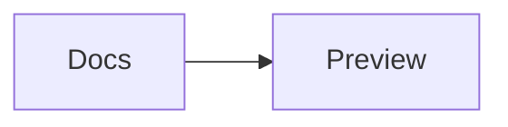

# Mermaid Preview Offline 1.0 — Guide utilisateur

[Read this guide in English](USER_GUIDE.md).

Mermaid Preview Offline est à la fois un éditeur VS Code, un service de langage,
un outil d’export et un espace de travail pour les diagrammes Mermaid. Le rendu
s’effectue localement avec le moteur Mermaid et les ressources intégrées à
l’extension. Aucun compte, service de rendu dans le cloud, CDN ou service de
télémétrie n’est nécessaire.

Ce guide couvre toutes les fonctionnalités de la version 1.0. Pour connaître la
syntaxe Mermaid exacte et son niveau de stabilité, consultez le
[catalogue de 43 exemples](../examples/README.md) et la
[matrice de compatibilité](../examples/COMPATIBILITY.md).

## Démarrage rapide

1. Installez l’extension, puis ouvrez un fichier `.mmd` ou `.mermaid`.
2. Utilisez le bouton de disposition dans la barre d’outils de l’aperçu pour
   choisir **Preview only**, **Source only**, **Beside** ou **Above**.
3. Modifiez le code source dans VS Code. Lorsque l’actualisation automatique est
   activée, l’aperçu se met à jour après le délai configuré.
4. Utilisez **Export** pour prévisualiser le résultat et l’enregistrer au format
   PNG, WebP, PDF, SVG optimisé ou SVG original.

Pour ouvrir temporairement un fichier Mermaid en texte brut, exécutez
**Reopen Editor With…** → **Text Editor**. Pour modifier l’association au niveau
de l’espace de travail, exécutez **Mermaid Preview: Configure Default Editor**.

## Ouvrir et organiser les diagrammes

### Fichiers pris en charge et association de l’éditeur

L’éditeur personnalisé est enregistré pour les fichiers `.mmd` et `.mermaid`.
Vous pouvez l’ouvrir en double-cliquant sur un fichier, en exécutant
**Mermaid Preview: Open Offline Preview** ou depuis le menu contextuel de
l’Explorateur. **Open Preview to the Side** conserve l’éditeur actuel visible et
ouvre l’aperçu dans un autre groupe.

**Configure Default Editor** propose trois choix :

- **Mermaid Preview (Offline)** associe les deux extensions de fichiers à
  l’aperçu personnalisé ;
- **Text Editor** les ouvre par défaut comme des documents texte VS Code
  ordinaires ;
- **Reset association** supprime la surcharge de l’espace de travail.

### Quatre dispositions

| Disposition | Résultat |
|---|---|
| **Preview only** | Le diagramme rendu occupe tout le groupe d’éditeurs. |
| **Source only** | L’éditeur texte Mermaid natif de VS Code occupe tout le groupe d’éditeurs. |
| **Beside** | Le code source est à gauche et l’aperçu à droite. |
| **Above** | Le code source est au-dessus de l’aperçu. |

Beside et Above utilisent un véritable éditeur texte VS Code : la coloration
syntaxique, l’autocomplétion, l’aide au survol, le formatage, les diagnostics,
les snippets, les corrections rapides et le renommage restent donc disponibles.
Faites glisser le séparateur des groupes d’éditeurs VS Code pour redimensionner
la paire. L’extension mémorise cette proportion pour chaque fichier et la
restaure lorsque la vue fractionnée est recréée.

Une seule paire source/aperçu compagnon suit la source Mermaid active. Lorsque
vous sélectionnez un autre onglet texte Mermaid en mode Beside ou Above, son
aperçu remplace le précédent au lieu de créer des panneaux en double.

### Restauration de session

La disposition sélectionnée est enregistrée pour l’espace de travail. Pour
chaque fichier Mermaid, l’extension enregistre également le zoom, le mode
d’ajustement, la position de défilement et la proportion de la vue fractionnée
native. VS Code restaure les onglets ouverts ; lorsqu’un aperçu est reconstruit,
l’extension réapplique son état d’affichage enregistré. Le thème de diagramme
sélectionné est commun aux aperçus de l’espace de travail actuel.

Si la vue fractionnée restaurée ne correspond plus à la disposition attendue,
sélectionnez de nouveau la disposition voulue. Si un aperçu obsolète subsiste
après l’interruption d’une session distante, fermez cet onglet et rouvrez la
source Mermaid ; le fichier source reste la référence.

## Rendu et navigation

### Actualisation automatique et manuelle

En mode **automatic**, les modifications du document sont rendues après le
délai `mermaidPreviewOffline.refreshDelay` (140 ms par défaut). Une modification
plus récente annule ou remplace un rendu en attente devenu obsolète. Les fichiers
dont la taille atteint ou dépasse `mermaidPreviewOffline.largeFileThresholdKb`
utilisent un délai minimal de 400 ms et affichent un indicateur de fichier
volumineux.

En mode **manual**, le diagramme actuel reste visible et le pied de page indique
**Changes pending**. Sélectionnez **Refresh** ou appuyez sur `R` pour rendre le
texte actuel. Le retour au mode automatique déclenche immédiatement le rendu.

Le pied de page indique la taille UTF-8 de la source, les dimensions naturelles
du diagramme, l’état et la durée du rendu, ainsi que le pourcentage de zoom
actuel.

### Zoom, déplacement, minimap et focus

| Action | Commande |
|---|---|
| Ajuster le diagramme entier | **Fit** dans la barre d’outils, ou `Ctrl/Cmd + 0` |
| Faire un zoom avant ou arrière | `+` / `-` dans la barre d’outils, `+` / `-` au clavier, ou `Ctrl/Cmd + mouse wheel` |
| Déplacer la vue | Faites glisser le canevas de l’aperçu ou utilisez le défilement normal |
| Parcourir un diagramme qui dépasse | Cliquez ou faites glisser dans la minimap |
| Agrandir le groupe d’éditeurs actif | **Full screen** dans la barre d’outils |

Le zoom est limité à une plage pratique de 15 à 400 %. La minimap apparaît
uniquement lorsqu’elle est activée et que le diagramme dépasse la zone visible.
Son rectangle représente la zone affichée ; cliquez ou faites-le glisser pour
déplacer cette zone dans un grand diagramme.

### Thèmes de diagramme et thèmes de couleurs VS Code

Le sélecteur de thème de l’aperçu propose **Adaptive**, **Default**, **Dark**,
**Forest**, **Neutral** et **Base**. Adaptive suit le thème clair, sombre ou à
contraste élevé actuellement utilisé par VS Code. L’interface de l’extension
utilise les variables de thème VS Code et prend en charge les thèmes clair,
sombre, clair à contraste élevé et sombre à contraste élevé.

Le thème de l’aperçu et celui de l’export sont indépendants. Vous pouvez ainsi
travailler dans un espace sombre tout en exportant, par exemple, un diagramme
neutre sur fond blanc.

## Erreurs et assistance à l’édition

### Erreurs de rendu

Si Mermaid ne peut pas rendre la source, l’aperçu affiche un message lisible et,
lorsque Mermaid les fournit, une ligne, une colonne et un extrait de la source
concernée. Utilisez **Open source** pour revenir à l’éditeur natif. Après avoir
corrigé la source, sélectionnez **Retry** ou **Refresh**.

La même erreur de rendu actuelle est publiée dans le panneau **Problems** de
VS Code et sous forme de soulignement dans l’éditeur. Les diagnostics associés à
une version obsolète du document sont ignorés au lieu d’être appliqués à une
source plus récente.

### Fonctionnalités de langage

L’extension fournit la coloration syntaxique Mermaid, la configuration du
langage et 43 snippets correspondant aux familles de diagrammes pour les
fichiers `.mmd` et `.mermaid`. L’éditeur texte natif propose également :

- l’autocomplétion des déclarations Mermaid et des mots-clés courants ;
- une documentation contextuelle au survol des mots-clés connus ;
- le formatage du document selon le réglage actif de tabulations ou d’espaces ;
- des diagnostics pour les déclarations inconnues, les flèches Unicode et les
  blocs non fermés ;
- des corrections rapides pour les fautes dans les déclarations, l’absence de
  déclaration flowchart, les flèches Unicode, les instructions `end` manquantes
  et les nœuds flowchart anonymes ;
- **Insert Node or Link**, qui demande des identifiants et des libellés sûrs ;
- **Generate Missing Identifiers**, qui attribue des identifiants stables aux
  nœuds anonymes ;
- **Rename Identifier**, qui renomme l’identifiant sélectionné dans tout le
  fichier Mermaid actuel.

Le renommage accepte les identifiants commençant par une lettre ou un caractère
de soulignement, puis composés de lettres, chiffres, caractères de soulignement
ou traits d’union. Avant d’appliquer une modification sémantique à l’ensemble
d’un projet, examinez la source modifiée, car les identifiants Mermaid peuvent
être réutilisés dans des libellés et des syntaxes propres à chaque diagramme.

## Compatibilité des diagrammes et des ressources

Mermaid `11.16.0` est intégré et épinglé. Le catalogue validé couvre les
43 fichiers et fonctionnalités suivants :

| Groupe | Couverture incluse |
|---|---|
| Flux et général | Flowchart, flowchart avec ELK, mindmap, timeline, pie, donut, quadrant, Venn, Ishikawa, Cynefin et tree view |
| UML et conception logicielle | Sequence, class, state, entity relationship, cinq variantes C4, ZenUML, architecture et packet |
| Planification et produit | User journey, Gantt, Git graph, Kanban, Wardley Map, Event Modeling et swimlanes |
| Données et graphiques | Sankey, XY chart, radar, treemap et block diagram |
| Grammaires et diagnostics | Native railroad, EBNF railroad, ABNF railroad, PEG railroad et informations du moteur Mermaid |
| Ressources intégrées | Packs d’icônes Iconify et images locales relatives |

Les alias historiques tels que `graph`, `flowchart-v2`, `classDiagram-v2` et
`stateDiagram` utilisent les mêmes familles de diagrammes intégrées. Les
syntaxes dont le mot-clé Mermaid contient `-beta`, ainsi que C4 et ZenUML,
doivent être considérées comme expérimentales même si leurs exemples intégrés
ont été validés.

### ZenUML

Le plug-in officiel `@mermaid-js/mermaid-zenuml` est enregistré depuis le bundle
local de l’extension. Commencez un diagramme par `zenuml` ; aucun téléchargement
n’est nécessaire pendant l’exécution. Consultez `examples/41-zenuml.mmd`.

### Icônes Iconify

Les packs Iconify `logos` et `material-icon-theme` sont intégrés et enregistrés
localement. Utilisez la syntaxe d’icône Mermaid habituelle, par exemple
`icon: "logos:react"`. Les autres packs Iconify ne sont pas inclus et ne sont
pas téléchargés automatiquement. Consultez `examples/42-icon-packs.mmd`.

### Images locales

Les références d’images relatives dans les attributs Mermaid `img:` sont
résolues depuis le répertoire du diagramme et intégrées sous forme d’URI `data:`
avant le rendu. Les extensions prises en charge sont SVG, PNG, JPEG, GIF, WebP,
AVIF, BMP et ICO. Le SVG enregistré reste ainsi portable.

Utilisez un chemin situé dans l’espace de travail actuel, par exemple :

```mermaid
flowchart LR
  logo@{ img: "assets/logo.svg", label: "Local logo" }
```

Les chemins absolus, les URL réseau et les chemins qui se résolvent en dehors
de l’espace de travail ne sont pas pris en charge. Dans un espace multi-racine,
le dossier d’espace de travail propre au diagramme est utilisé. Les espaces de
travail distants utilisent le fournisseur de système de fichiers VS Code actif.

## Exporter les diagrammes

Ouvrez la boîte de dialogue d’export depuis la barre d’outils de l’aperçu, la
palette de commandes, le titre de l’éditeur ou le menu contextuel de
l’Explorateur. Elle génère un aperçu en direct et affiche les dimensions finales
en pixels ou de la page avant l’enregistrement.

### Formats

| Format | Comportement |
|---|---|
| **PNG** | Sortie matricielle sans perte ; prend en charge le DPI, l’échelle, la marge, l’arrière-plan, les métadonnées et la copie dans le presse-papiers. |
| **WebP** | Sortie matricielle compacte avec les mêmes réglages de dimensions. |
| **PDF** | Une page opaque dimensionnée selon le diagramme rendu et ses marges. |
| **Optimized SVG** | Sortie vectorielle portable avec optimisation, métadonnées, marge et arrière-plan facultatifs. |
| **Original SVG** | SVG rendu par Mermaid, copié ou enregistré sans modification ; les réglages de décoration de sortie sont désactivés. |

Le bouton **Copy SVG** de la barre d’outils copie le SVG original actuellement
rendu. La boîte de dialogue d’export peut copier séparément le SVG original, le
SVG optimisé ou le PNG.

### Réglages d’export

- **Theme:** Adaptive, Default, Dark, Forest, Neutral ou Base.
- **Scale:** de 0.25 à 8.
- **DPI:** de 72 à 600 pour les sorties matricielles et PDF.
- **Margin:** de 0 à 512 pixels CSS.
- **Background:** Transparent ou une couleur hexadécimale à six chiffres. Le PDF
  est toujours opaque.
- **Name template:** jusqu’à 160 caractères, avec `{name}`, `{format}`, `{theme}`,
  `{scale}`, `{dpi}`, `{date}`, `{time}` et `{ext}`.
- **Optimize SVG:** simplifie la sortie vectorielle préparée avant son
  enregistrement ou sa conversion matricielle.
- **Include metadata:** ajoute le nom de la source, son URI et l’heure d’export
  aux formats compatibles.
- **Original SVG:** conserve la sortie vectorielle Mermaid originale lorsque
  SVG est le format sélectionné.

Les caractères interdits dans les noms de fichiers sont remplacés avant
l’enregistrement. Une extension de format manquante est ajoutée automatiquement.

### Profils et export de dossier

Saisissez un nom de profil et sélectionnez **Save profile** pour conserver les
réglages d’export actuels. Les profils sont disponibles dans tous les espaces de
travail du même profil VS Code ; jusqu’à 40 profils normalisés sont conservés.
Sélectionnez un profil pour l’appliquer ou utilisez **Delete** pour le supprimer.

Sélectionnez **Export folder…** pour choisir un dossier source et une
destination. L’extension recherche récursivement les fichiers `.mmd` et
`.mermaid`, conserve leur arborescence relative, applique les réglages d’export
actifs et signale chaque échec sans écraser les fichiers sources.

## CLI hors ligne

Le dépôt et l’extension empaquetée incluent l’outil de rendu en ligne de commande
`mpo`. Il nécessite Node.js 22 et un exécutable Chrome, Chromium ou Edge
installé ; aucun service de rendu distant n’est utilisé.

```bash
npm ci
npm run build
npm link

mpo examples/01-flowchart.mmd --format png --dpi 300 --scale 2
mpo examples --output exported --format pdf --theme neutral --json
```

| Option | Fonction |
|---|---|
| `-o, --output <path>` | Fichier ou dossier de sortie. |
| `--format <format>` | `svg`, `png`, `webp` ou `pdf`. |
| `--scale <factor>` | Échelle de 0.25 à 8. |
| `--dpi <number>` | Résolution de 72 à 600 DPI. |
| `--margin <pixels>` | Espace autour du diagramme. |
| `--background <value>` | `transparent` ou `#rrggbb`. |
| `--theme <theme>` | `adaptive`, `default`, `dark`, `forest`, `neutral` ou `base`. |
| `--name-template <template>` | Jetons de nommage de sortie utilisés par la boîte de dialogue d’export. |
| `--profile <json>` | Charge les réglages d’export depuis un profil JSON. |
| `--original-svg` | Conserve la sortie SVG inchangée. |
| `--no-optimize` | Désactive l’optimisation SVG. |
| `--no-metadata` | Omet les métadonnées de la source. |
| `--browser <path>` | Utilise un exécutable Chrome, Chromium ou Edge précis. |
| `--json` | Affiche des résultats lisibles par une machine. |
| `-h, --help` | Affiche toutes les options. |
| `-v, --version` | Affiche la version du CLI. |

Pour un dossier en entrée, le CLI exporte récursivement les fichiers Mermaid et
conserve l’arborescence du répertoire source dans le dossier de sortie choisi.
Un code de sortie non nul indique une erreur d’arguments, de découverte, de
navigateur, de rendu ou d’écriture.

## Tâches d’export VS Code

L’extension fournit le type de tâche `mermaid-export`. Il utilise le même moteur
de rendu local et peut exporter un fichier ou un dossier depuis **Run Task** ou
dans les environnements CI qui disposent d’un navigateur compatible.

```json
{
  "version": "2.0.0",
  "tasks": [
    {
      "label": "Export Mermaid documentation",
      "type": "mermaid-export",
      "source": "${workspaceFolder}/docs/diagrams",
      "output": "${workspaceFolder}/build/diagrams",
      "format": "png",
      "theme": "neutral",
      "scale": 2,
      "dpi": 300,
      "margin": 24,
      "background": "#ffffff",
      "nameTemplate": "{name}.{format}",
      "optimizeSvg": true,
      "includeMetadata": true
    }
  ]
}
```

| Propriété | Obligatoire/valeur par défaut | Fonction |
|---|---|---|
| `type` | Obligatoire : `mermaid-export` | Sélectionne ce fournisseur de tâche. |
| `source` | Obligatoire | Fichier ou dossier Mermaid. Prend en charge `${workspaceFolder}`, `${file}` et `${fileDirname}`. |
| `output` | Selon la source | Fichier ou dossier de sortie ; prend en charge les mêmes variables. |
| `format` | `png` | `svg`, `png`, `webp` ou `pdf`. |
| `theme` | `default` | Tout thème Mermaid pris en charge. |
| `scale` | `1` | Échelle de 0.25 à 8. |
| `dpi` | `144` | Résolution de 72 à 600. |
| `margin` | `24` | Marge de 0 à 512. |
| `background` | `transparent` | `transparent` ou une couleur `#rrggbb`. |
| `nameTemplate` | `{name}-{theme}@{scale}x.{format}` | Modèle de nommage de sortie. |
| `optimizeSvg` | `true` | Optimise le SVG généré. |
| `includeMetadata` | `true` | Inclut les métadonnées prises en charge. |
| `browser` | Détection automatique | Chemin facultatif de l’exécutable du navigateur. |

## Diagram Studio et générateurs

Exécutez **Mermaid Preview: New Diagram from Template…** pour ouvrir Diagram
Studio. Il propose une source et un aperçu en direct, des champs de modèle
modifiables, la modification directe facultative de la source et une étape
d’enregistrement dans l’espace de travail.

Les huit modèles intégrés sont :

1. Process flow
2. Service sequence
3. Domain classes
4. Entity relationship
5. Delivery plan
6. Customer journey
7. Idea map
8. System landscape

Exécutez **Mermaid Preview: Browse Example Gallery…** pour effectuer une
recherche dans les 43 exemples intégrés, filtrer par catégorie, examiner leur
rendu et créer une copie modifiable dans l’espace de travail.

La version 1.0 propose également deux générateurs de projet locaux :

- **Mermaid Preview: Generate ERD from SQL Schema…** lit le sous-ensemble
  déclaratif courant de `CREATE TABLE` dans un fichier `.sql` UTF-8 local, y
  compris les colonnes et relations de clés primaires/étrangères, puis propose
  `<schema-name>-erd.mmd` ;
- **Mermaid Preview: Generate Dependency Graph from package.json…** lit les
  propriétés locales `dependencies`, `devDependencies`, `peerDependencies` et
  `optionalDependencies`, différencie leurs groupes dans un flowchart, puis
  propose `dependency-graph.mmd`.

Chaque entrée est limitée à 4 MB. Une fois le fichier de sortie choisi, le
diagramme généré s’ouvre dans l’aperçu hors ligne habituel. Le résultat est une
source Mermaid ordinaire : examinez-la, modifiez ses libellés ou ses liens, puis
utilisez les fonctions habituelles d’aperçu et d’export. Aucun service distant
d’analyse de schéma ou de paquet n’intervient.

## Comparaison visuelle Git

Pour un fichier `.mmd` ou `.mermaid`, exécutez
**Mermaid Preview: Compare Git Versions Visually…**. Sélectionnez une révision
avant et une révision après ; les choix comprennent les références locales,
`HEAD` et l’arbre de travail. L’extension lit les révisions par l’intermédiaire
de l’extension Git intégrée à VS Code.

La comparaison visuelle propose :

- des diagrammes rendus côte à côte ;
- une superposition colorée des ajouts, modifications et suppressions ;
- le nombre de lignes sources modifiées ;
- un zoom et une navigation synchronisés.

Si l’éditeur de comparaison texte de VS Code affiche déjà un fichier Mermaid,
sélectionnez **Mermaid Preview: Preview Diff Visually** dans le titre de
l’éditeur pour réutiliser ses entrées originale et modifiée. La comparaison Git
nécessite un dépôt local et l’extension Git intégrée activée ; un diff texte
ordinaire peut tout de même être prévisualisé sans sélectionner de révisions.

## Markdown, MDX et AsciiDoc

L’extension détecte les blocs Mermaid dans Markdown (`.md`, `.markdown`), MDX
(`.mdx`) et AsciiDoc (`.adoc`, `.asciidoc`, `.asc`).

### Formes de blocs prises en charge

Markdown et MDX acceptent les fences à accents graves ou tildes, y compris la
syntaxe avec attribut :

````markdown


~~~{.mermaid}
sequenceDiagram
  Editor->>Preview: Update
~~~
````

AsciiDoc accepte les attributs Mermaid ou les attributs source suivis d’un
délimiteur de bloc correspondant d’au moins quatre caractères :

```asciidoc
[mermaid]
....
flowchart LR
  Docs --> Preview
....

[source,mermaid]
----
sequenceDiagram
  Editor->>Preview: Update
----
```

### Prévisualiser et naviguer

Placez le curseur dans un bloc et exécutez **Preview Block Under Cursor** pour
le cibler. Exécutez **Preview All Blocks in Document** pour ouvrir une vue en
direct du document. Elle se met à jour après les modifications de la source.
Sélectionnez **Go to source**, ou double-cliquez sur le canevas d’un diagramme,
pour afficher et sélectionner le bloc source correspondant.

### Exporter une copie de la documentation

Exécutez **Export Document with Diagram Images…**, puis choisissez SVG optimisé
ou PNG. L’extension crée une nouvelle copie du document et remplace chaque bloc
Mermaid par une référence relative vers une image locale. Les images sont
écrites dans un répertoire dédié `<document>.assets` à côté de la copie. Le PNG
utilise le thème, le DPI, l’échelle, la marge et l’arrière-plan d’export
configurés. Le document source n’est pas écrasé.

## Référence des commandes

| Intitulé dans la palette de commandes | Disponibilité et résultat |
|---|---|
| **Mermaid Preview: Open Offline Preview** | Ouvre un fichier Mermaid dans l’aperçu personnalisé. |
| **Mermaid Preview: Open Preview to the Side** | Ouvre un aperçu compagnon dans un autre groupe d’éditeurs. |
| **Mermaid Preview: Choose Editor Layout** | Permet de choisir l’une des quatre dispositions. |
| **Mermaid Preview: Preview Only** | Passe en mode Preview only. |
| **Mermaid Preview: Source Only** | Passe en mode Source only. |
| **Mermaid Preview: Source Beside Preview** | Passe en mode Beside. |
| **Mermaid Preview: Source Above Preview** | Passe en mode Above. |
| **Mermaid Preview: Configure Default Editor** | Modifie l’association de l’éditeur dans l’espace de travail. |
| **Mermaid: Format Document** | Éditeur Mermaid et menu contextuel de l’éditeur. |
| **Mermaid: Insert Node or Link** | Éditeur Mermaid et menu contextuel de l’éditeur. |
| **Mermaid: Generate Missing Identifiers** | Éditeur Mermaid et menu contextuel de l’éditeur. |
| **Mermaid: Rename Identifier** | Éditeur Mermaid et menu contextuel de l’éditeur. |
| **Mermaid Preview: Export Diagram…** | Barre d’outils de l’aperçu, titre de l’éditeur, Explorateur ou palette de commandes. |
| **Mermaid Preview: New Diagram from Template…** | Ouvre Diagram Studio sur l’onglet des modèles. |
| **Mermaid Preview: Browse Example Gallery…** | Ouvre Diagram Studio sur l’onglet de la galerie. |
| **Mermaid Preview: Generate Custom Diagram…** | Ouvre Diagram Studio avec les générateurs. |
| **Mermaid Preview: Generate ERD from SQL Schema…** | Génère une source Mermaid ER à partir d’un schéma SQL local. |
| **Mermaid Preview: Generate Dependency Graph from package.json…** | Génère une source de graphe Mermaid à partir d’un manifeste de paquet local. |
| **Mermaid Preview: Compare Git Versions Visually…** | Contextes Explorateur/titre Mermaid et palette de commandes. |
| **Mermaid Preview: Preview Diff Visually** | Titre de l’éditeur de diff texte Mermaid et palette de commandes. |
| **Mermaid Preview: Preview Block Under Cursor** | Éditeur Markdown, MDX ou AsciiDoc. |
| **Mermaid Preview: Preview All Blocks in Document** | Éditeur Markdown, MDX ou AsciiDoc. |
| **Mermaid Preview: Export Document with Diagram Images…** | Éditeur Markdown, MDX ou AsciiDoc. |

Les commandes n’apparaissent dans les menus que lorsque le contexte de la
ressource et de l’éditeur s’y prête, mais elles restent accessibles depuis la
palette de commandes après l’activation de l’extension.

## Référence des réglages

| Réglage | Valeur par défaut | Portée et effet |
|---|---:|---|
| `mermaidPreviewOffline.refreshMode` | `automatic` | Rendu automatique en direct ou actualisation manuelle. |
| `mermaidPreviewOffline.refreshDelay` | `140` | Délai par ressource en millisecondes, de 0 à 2000. Les fichiers volumineux utilisent au moins 400 ms. |
| `mermaidPreviewOffline.largeFileThresholdKb` | `512` | Seuil par ressource, de 64 à 10240 KB. |
| `mermaidPreviewOffline.minimap.enabled` | `true` | Disponibilité de la minimap par ressource. |
| `mermaidPreviewOffline.diagramTheme` | `adaptive` | Thème d’aperçu de l’espace de travail ou de la fenêtre. |
| `mermaidPreviewOffline.export.format` | `png` | Valeur par défaut de la ressource : SVG, PNG, WebP ou PDF. |
| `mermaidPreviewOffline.export.theme` | `default` | Thème d’export par ressource, indépendant de l’aperçu. |
| `mermaidPreviewOffline.export.scale` | `1` | Échelle par ressource, de 0.25 à 8. |
| `mermaidPreviewOffline.export.dpi` | `144` | DPI matriciel/PDF par ressource, de 72 à 600. |
| `mermaidPreviewOffline.export.margin` | `24` | Marge en pixels CSS par ressource, de 0 à 512. |
| `mermaidPreviewOffline.export.background` | `transparent` | Valeur par ressource : `transparent` ou `color`. |
| `mermaidPreviewOffline.export.backgroundColor` | `#ffffff` | Couleur à six chiffres par ressource utilisée par `color`. |
| `mermaidPreviewOffline.export.fileNameTemplate` | `{name}-{theme}@{scale}x.{format}` | Jetons de nommage par ressource. |
| `mermaidPreviewOffline.export.optimizeSvg` | `true` | Valeur d’optimisation SVG par ressource. |
| `mermaidPreviewOffline.export.includeMetadata` | `true` | Valeur des métadonnées par ressource. |

Exemple de réglages d’espace de travail :

```json
{
  "mermaidPreviewOffline.refreshMode": "automatic",
  "mermaidPreviewOffline.refreshDelay": 200,
  "mermaidPreviewOffline.diagramTheme": "adaptive",
  "mermaidPreviewOffline.export.format": "svg",
  "mermaidPreviewOffline.export.theme": "neutral",
  "mermaidPreviewOffline.export.fileNameTemplate": "{name}-{date}.{format}"
}
```

## Vie privée, fonctionnement hors ligne et compatibilité

Le rendu des diagrammes, l’enregistrement des plug-ins, les icônes, l’intégration
des images locales, les exports, les modèles, les exemples, les services de
langage et les générateurs s’exécutent localement. L’extension ne possède ni
système de compte, ni télémétrie, ni analyse d’usage, ni police distante, ni
téléchargement de ressources pendant l’exécution. Ses webviews d’aperçu bloquent
les connexions réseau et Mermaid est configuré en mode strict.

Le CLI et le moteur de rendu des tâches VS Code nécessitent un navigateur local
basé sur Chromium, mais aucun service de rendu dans le cloud. Un exécutable de
navigateur peut être sélectionné explicitement lorsque la détection automatique
ne convient pas.

La version de VS Code prise en charge, la version de Node.js requise, la version
de Mermaid et celles des plug-ins intégrés sont déclarées dans `package.json`.
La syntaxe des familles Mermaid expérimentales peut changer entre les versions
de Mermaid ; utilisez la matrice de compatibilité et les exemples épinglés
lorsqu’un résultat reproductible est important.

## Dépannage

### Un fichier Mermaid s’ouvre comme du texte

Exécutez **Mermaid Preview: Open Offline Preview** ou **Reopen Editor With…** →
**Mermaid Preview (Offline)**. Utilisez **Configure Default Editor** pour
réparer l’association dans l’espace de travail. Les associations d’éditeur de
l’espace de travail peuvent remplacer la valeur globale par défaut.

### L’aperçu indique « Changes pending »

Le mode d’actualisation manuelle est actif. Sélectionnez **Refresh**, appuyez sur
`R` ou attribuez la valeur `automatic` à
`mermaidPreviewOffline.refreshMode`.

### Le rendu est retardé

Vérifiez `refreshDelay` et `largeFileThresholdKb`. Les fichiers au-dessus du
seuil utilisent un délai minimal de 400 ms. Le pied de page identifie les
fichiers volumineux et affiche la progression du rendu. Réduisez les
modifications inutiles de la source avant de diminuer le délai.

### Le diagramme ne tient pas dans la vue ou la minimap est absente

Appuyez sur `Ctrl/Cmd + 0` pour réactiver le mode d’ajustement. La minimap
apparaît uniquement lorsque le diagramme dépasse et que
`mermaidPreviewOffline.minimap.enabled` vaut true. Un zoom avant peut faire
dépasser un diagramme auparavant ajusté.

### Une image locale est absente

Utilisez un chemin relatif pris en charge depuis le fichier Mermaid, conservez
l’image dans le même dossier d’espace de travail et vérifiez que son extension
est SVG, PNG, JPEG, GIF, WebP, AVIF, BMP ou ICO. Les URL réseau, chemins absolus,
formats non pris en charge, fichiers illisibles et chemins hors de l’espace de
travail sont volontairement ignorés.

### Le résultat exporté diffère de l’aperçu

Le thème d’export est indépendant du thème d’aperçu. Vérifiez le thème,
l’arrière-plan, l’échelle, le DPI, la marge et si **Original SVG** est
sélectionné. Original SVG n’applique ni optimisation, ni métadonnées, ni
arrière-plan, ni réglage de marge.

### L’export CLI ou par tâche ne trouve pas de navigateur

Installez Chrome, Chromium ou Edge, ou fournissez `--browser <path>` au CLI.
Pour une tâche `mermaid-export`, définissez sa propriété `browser`. Vérifiez que
le processus qui exécute VS Code ou le terminal peut lancer ce binaire.

### La comparaison visuelle Git ne propose aucune révision

Vérifiez que le fichier appartient à un dépôt Git, que l’extension Git intégrée
à VS Code est activée et que le fichier possède un historique enregistré. Pour
comparer un diff texte déjà ouvert, utilisez **Preview Diff Visually**.

### L’aperçu de documentation ne trouve aucun bloc

Placez le curseur entre les délimiteurs d’ouverture et de fermeture. Pour
Markdown/MDX, utilisez une fence `mermaid` ou l’attribut `{.mermaid}`. Pour
AsciiDoc, utilisez `[mermaid]` ou `[source,mermaid]` suivi des délimiteurs
correspondants `....` ou `----`.

### La disposition ou la position restaurée est obsolète

Sélectionnez de nouveau la disposition voulue, utilisez Fit si nécessaire, puis
fermez et rouvrez l’aperçu. L’état d’affichage est enregistré par fichier et par
espace de travail ; déplacer ou renommer un fichier crée une nouvelle identité
d’état.

### L’environnement est hors ligne

L’aperçu, l’assistance à l’édition, les exemples intégrés, ZenUML, les deux packs
Iconify intégrés, les images locales, les exports, Studio, les générateurs et les
vues de documentation restent disponibles. L’installation depuis la Marketplace,
les mises à jour de l’extension et l’ouverture de liens GitHub externes
nécessitent naturellement une connexion.

## Références complémentaires

- [Catalogue d’exemples](../examples/README.md)
- [Matrice de compatibilité Mermaid](../examples/COMPATIBILITY.md)
- [Plan des captures d’écran pour le README et le guide utilisateur](SCREENSHOTS.md)
- [Guide de publication](PUBLISHING.md)
- [Roadmap du projet](../roadmap.md)
