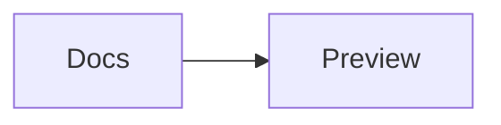

# Mermaid Preview Offline 1.2.6 — User guide

[Lire ce guide en français](USER_GUIDE.fr.md).

Mermaid Preview Offline is a VS Code editor, language service, export tool, and
project workspace for Mermaid diagrams. Rendering runs locally with the Mermaid
engine and assets bundled in the extension. It does not require an account,
cloud renderer, CDN, or telemetry service.

This guide covers the complete 1.2.6 feature set. For exact Mermaid syntax and
stability, see the [44-example catalogue](../examples/README.md) and
[compatibility matrix](../examples/COMPATIBILITY.md).

## New in version 1.2.6

Version 1.2.6 removes the editor-group choreography behind split previews:

- Preview, Beside, and Above now live inside one custom-editor tab;
- changing layout cannot create, resize, move, or close VS Code editor groups;
- Beside and Above use a local draggable separator whose ratio is restored;
- Source only opens VS Code's full Mermaid text editor automatically;
- integrated split-source edits are serialized and version-checked;
- the toolbar gains wide labels, progressive collapse, complete visibility and
  label settings, and per-control selection, with icon-only as the default.

## Quick start

1. Install the extension, then open a `.mmd` or `.mermaid` file.
2. Use the layout button in the preview toolbar to choose **Preview only**,
   **Source only**, **Beside**, or **Above**.
3. Edit the source in VS Code. With automatic refresh enabled, the preview
   updates after the configured delay.
4. Use **Export** to inspect the output and save PNG, WebP, PDF, optimized SVG,
   or original SVG.

To temporarily open a Mermaid file as plain text, run **Reopen Editor With…** →
**Text Editor**. To change the workspace association, run **Mermaid Preview:
Configure Default Editor**.


## Open and arrange diagrams

### Supported files and editor association

The custom editor is registered for `.mmd` and `.mermaid`. You can open it by
double-clicking a file, running **Mermaid Preview: Open Offline Preview**, or
using the Explorer context menu. **Open Preview to the Side** leaves the current
editor visible and opens the preview in another group.

**Configure Default Editor** offers three choices:

- **Mermaid Preview (Offline)** associates both Mermaid extensions with the
  custom preview.
- **Text Editor** opens them as normal VS Code text documents by default.
- **Reset association** removes the workspace override.

### Four layouts

| Layout | Result |
|---|---|
| **Preview only** | The rendered diagram fills the editor group. |
| **Source only** | VS Code's full Mermaid text editor opens in the preview column. |
| **Beside** | Source is on the left and the preview is on the right. |
| **Above** | Source is above the preview. |


Preview, Beside, and Above stay inside the same custom-editor tab. Beside and
Above use a local split, so selecting either layout does not create a second
editor group or alter unrelated tabs. Drag the internal separator to resize the
pair; the ratio is restored with the file. Source only leaves the custom surface
and opens VS Code's full text editor automatically.

The source surface embedded in Beside and Above supports editing, line
navigation, save, and conflict-safe synchronization. It is intentionally a
lightweight textarea, so syntax coloring, completion, hover help, snippets,
formatting, diagnostics, quick fixes, and rename remain in the full VS Code
editor. Use **Source only** or **Full editor** whenever those features are
needed.
With the preview focused, press `P` repeatedly to cycle through Preview only,
Beside, Above, and back to Preview only. From the Mermaid source editor, use
`Alt+P` (`Option+P` on macOS) to enter or continue that cycle; plain `P` remains
available for typing.
Click anywhere on the diagram canvas or minimap to focus the preview. The focus
is also restored after each layout transition, and `P` continues to work when a
toolbar button has focus. Export form fields keep their normal keyboard input.

Each preview stays pinned to its Mermaid file. Opening or focusing another
source never closes, replaces, or moves an existing preview. Run Beside or Above
for another file when you want another internal pair. The managed preview mode
is workspace-wide: after selecting Preview, Beside, or Above, every Mermaid file
opened from the Explorer inherits that mode. Detached windows remain independent.

Copying the preview to a new VS Code window does not change the main Beside or
Above layout. Auxiliary previews are explicitly marked as detached, keep their
own view state, and cannot change the layout of the original window.

### Session restoration

Zoom, fit mode, scroll position, and split ratio are stored per Mermaid file.
The selected Preview/Beside/Above mode is stored once for the workspace so it
survives navigation between files. When a webview is reconstructed, the
extension reapplies this lightweight state instead of keeping every hidden
Mermaid renderer alive. The selected diagram theme and diagram font are shared
by previews in the current VS Code window.

## Rendering and navigation

### Live and manual refresh

In **automatic** mode, document changes are rendered after
`mermaidPreviewOffline.refreshDelay` (140 ms by default). A newer edit cancels or
supersedes an obsolete pending render. Files at or above
`mermaidPreviewOffline.largeFileThresholdKb` use at least a 400 ms delay and show
a large-file indicator.

In **manual** mode, the current diagram stays visible and the footer reports
**Changes pending**. Select **Refresh** or press `R` to render the current text.
Changing back to automatic mode renders immediately.

The footer reports the UTF-8 source size, natural diagram dimensions, render
status and timing, and current zoom percentage.

### Responsive toolbar

The toolbar is grouped in this order: preview mode; zoom; refresh and search;
appearance, Copy SVG, Save SVG, and Export; new window. Separators remain
aligned with those groups even when individual controls are disabled.

The default label mode is icon-only. In responsive or always-labelled mode,
**Fit**, Zoom in, and Zoom out still remain icon-only. Other responsive labels
disappear in this exact order: new window, Export, Copy/Save SVG, Search, then
Appearance. Refresh and Preview mode keep their labels until very narrow
widths. Tooltips and accessible names remain available after collapse.

Use `toolbar.labelMode` to keep the responsive behavior, force an icon-only
bar, or always show labels. `toolbar.visible` hides the complete bar, and
`toolbar.controls` selects the exact actions shown.

### Resource safeguards

The following fixed limits prevent one preview or export from consuming
unbounded memory. They are safety ceilings, not configurable quality settings.

| Resource | Limit | User-visible behavior |
|---|---:|---|
| Mermaid source | 10 MiB of UTF-8 source | The preview pauses rendering and shows the measured size and 10 MiB ceiling. Text editing remains available. CLI and folder/batch rendering reject or skip the oversized file with the same limit. |
| Local images in one diagram | 64 unique relative images | Rendering stops with the detected count and the 64-image ceiling. |
| One local image | 8 MiB | Rendering stops and identifies the oversized reference. |
| All local images in one diagram | 24 MiB combined | Rendering stops with an aggregate-limit message. |
| Rasterized export | 32,000,000 pixels | PNG, WebP, or PDF export stops before creating an oversized canvas and asks you to reduce scale or DPI. |

SVG is vector output and is not subject to the 32-megapixel raster budget.
Optimize image files or split image-heavy diagrams; split an exceptional source
file into smaller diagrams; and lower DPI or scale when a raster export exceeds
its budget.

### Zoom, pan, minimap, and focus

| Action | Control |
|---|---|
| Fit the full diagram | Toolbar **Fit**, or `Ctrl/Cmd + 0` |
| Zoom in or out | Toolbar or keyboard `+` / `-`; `Ctrl/Cmd` or `Alt/Option` + wheel for pointer-centered zoom and trackpad pinch |
| Zoom from the canvas | `Alt/Option` + click to zoom in; add `Shift` to zoom out |
| Pan | Drag according to `navigation.mouse` |
| Navigate an overflowing diagram | Click or drag inside the minimap |
| Find a rendered label | `/` or `Ctrl/Cmd+F`, then Enter/Shift+Enter |
| Reveal source | Click a rendered node, cluster, actor, mindmap, or timeline item |
| Copy preview to another window | Toolbar **Open in new window**; the original stays visible |


Zoom is constrained to a practical 15–400% range. Set
`mermaidPreviewOffline.navigation.mouse` to `always`, `alt`, or `never`, and
`mermaidPreviewOffline.navigation.controls` to `always`, `onHoverOrFocus`, or
`never`. The minimap appears only when
it is enabled and the diagram exceeds the viewport. Its rectangle represents
the visible area; click or drag to move that area across a large diagram. Its
background and optional dots or grid stay synchronized with the active canvas.


### Diagram themes and VS Code color themes

The visual appearance gallery offers **Adaptive**, **Default**, **Dark**,
**Forest**, **Neutral**, **Base**, **Neo**, **Neo Dark**, **Vibrant**,
**Vibrant Dark**, and **Sketch**. Sketch uses a deterministic hand-drawn seed,
so repeated renders stay stable. Adaptive and Sketch derive their light or dark
palette from the selected canvas background, falling back to VS Code when the
canvas follows the editor.

Choose Compact, Comfortable, or Spacious density. Canvas presets include the
VS Code editor, white, paper, soft gray, soft blue, soft rose, slate, midnight,
and any custom six-digit color. Dots, grid, and pattern-free modes are available
independently. These workspace settings are shared by file previews,
documentation blocks, Diagram Studio, visual diffs, exports, tasks, and CLI
rendering where applicable. Selections made in a file preview are retained in
workspace state, so switching, closing, or reopening a diagram does not restore
the appearance defaults.

The preview theme and export theme are independent. This lets you edit in a dark
workspace while exporting, for example, a neutral diagram on white.


### Diagram typography

`mermaidPreviewOffline.diagramFontFamily` controls diagram text in file
previews, documentation previews, Diagram Studio, visual comparisons, and
prepared exports. It has three window-scoped values:

| Value | Behavior |
|---|---|
| `vscode` (default) | Uses VS Code's resolved `--vscode-font-family`. Renderers without that CSS variable, including the standalone CLI, use a system UI font stack. |
| `noto-sans` | Uses the bundled Noto Sans regular face for Latin and Latin Extended text. |
| `inter` | Uses the bundled Inter regular face for Latin and Latin Extended text. |

Choose `vscode` when you want the diagram to feel native to the current editor.
The exact installed typeface and its metrics can differ between operating
systems or VS Code profiles. Choose Noto Sans or Inter when consistent accented
glyphs, layout metrics, and cross-platform output matter: both fonts are
embedded in the extension and require no runtime download.

Optimized SVG, PNG, WebP, and PDF rendering can carry the selected bundled font,
so Noto Sans and Inter are the portable and reproducible choices for shared
exports. **Original SVG** intentionally preserves Mermaid's unmodified output;
it does not receive export-time font embedding and can therefore use a fallback
when opened on a machine without the named font.

## Errors and editing assistance

### Render errors

If Mermaid cannot render the source, the preview shows a readable message and,
when Mermaid provides them, a line, column, and nearby source excerpt. Use
**Open source** to return to the native editor. After correcting the source,
select **Retry** or **Refresh**.

The same current render error is published to VS Code's **Problems** panel and
as an editor underline. Diagnostics from an obsolete document version are
discarded rather than applied to newer source.

### Language features

The extension contributes Mermaid syntax highlighting, language configuration,
and 43 diagram-family snippets for `.mmd` and `.mermaid` files. The native text
editor also provides:

- completion for Mermaid declarations and common keywords;
- contextual hover documentation for known keywords;
- document formatting with the active tab/space indentation preference;
- diagnostics for unknown declarations, Unicode arrows, and unclosed blocks;
- quick fixes for declaration typos, a missing flowchart declaration, Unicode
  arrows, missing `end` statements, and anonymous flowchart nodes;
- **Insert Node or Link**, which prompts for safe identifiers and labels;
- **Generate Missing Identifiers**, which gives anonymous nodes stable IDs;
- **Rename Identifier**, which renames the selected identifier throughout the
  current Mermaid file.

Rename accepts identifiers that begin with a letter or underscore and then use
letters, digits, underscores, or hyphens. Before applying a project-wide semantic
change, review the edited source because Mermaid identifiers can be reused in
labels and diagram-specific syntax.

<p align="center">
  
  
</p>

## Diagram and asset compatibility

Mermaid `11.16.0` is bundled and pinned. The validated catalogue includes these
44 files and capabilities:

| Group | Included coverage |
|---|---|
| Flow and general | Flowchart, flowchart with ELK, mindmap with default and tidy-tree layouts, timeline, pie, donut, quadrant, Venn, Ishikawa, Cynefin, and tree view |
| UML and software design | Sequence, class, state, entity relationship, requirement, five C4 variants, ZenUML, architecture, and packet |
| Planning and product | User journey, Gantt, Git graph, Kanban, Wardley Map, Event Modeling, and swimlanes |
| Data and charts | Sankey, XY chart, radar, treemap, and block diagram |
| Grammars and diagnostics | Native railroad, EBNF railroad, ABNF railroad, PEG railroad, and Mermaid engine info |
| Bundled assets | Iconify icon packs and relative local images |

<p align="center">
  
  
</p>

Historical aliases such as `graph`, `flowchart-v2`, `classDiagram-v2`, and
`stateDiagram` use the same bundled diagram families. Syntaxes whose Mermaid
keyword contains `-beta`, plus C4 and ZenUML, should be treated as experimental
even though their bundled examples are validated.

### ZenUML

The official `@mermaid-js/mermaid-zenuml` plug-in is included in the local
extension bundle and loaded on demand when a ZenUML diagram is rendered. Start
a diagram with `zenuml`; no runtime download is needed. See
`examples/41-zenuml.mmd`.

### Iconify icons

The `logos`, `mdi`, and `material-icon-theme` Iconify packs are bundled and
registered locally. Use normal Mermaid icon syntax such as `icon: "logos:react"`
or `icon: "mdi:account-edit"`. Other Iconify packs are not included and are not
downloaded automatically. See
`examples/42-icon-packs.mmd`.


### Local images

Relative image references in Mermaid `img:` attributes are resolved from the
diagram's directory and embedded as `data:` URIs before rendering. Supported
extensions are SVG, PNG, JPEG, GIF, WebP, AVIF, BMP, and ICO. This keeps saved
SVG output portable.


Use a path inside the current workspace, for example:

```text
flowchart LR
  logo@{ img: "assets/logo.svg", label: "Local logo" }
```

Absolute paths, network URLs, and paths that resolve outside the workspace are
not supported. In a multi-root workspace, the diagram's own workspace folder is
used. Remote workspaces use the active VS Code file-system provider.

## Export diagrams

Open the export dialog from the preview toolbar, Command Palette, editor title,
or Explorer context menu. The dialog renders a live preview and displays final
pixel/page dimensions before you save.


### Formats

| Format | Behavior |
|---|---|
| **PNG** | Lossless raster output; supports DPI, scale, margin, background, metadata, and clipboard copy. |
| **WebP** | Compact raster output with the same sizing controls. |
| **PDF** | One opaque page sized to the rendered diagram and margins. |
| **Optimized SVG** | Portable vector output with optional optimization, metadata, margin, and background. |
| **Original SVG** | Mermaid's rendered SVG copied or saved unchanged; output decoration controls are disabled. |

The toolbar's **Copy SVG** copies the current original rendered SVG.
**Save SVG** opens a native save dialog for that same original SVG. Neither
action opens the professional export dialog, which can separately copy original
SVG, optimized SVG, or PNG.


### Export controls

- **Theme:** all classic, Neo, Vibrant, and Sketch appearances.
- **Scale:** 0.25–8.
- **DPI:** 72–600 for raster and PDF output.
- **Margin:** 0–512 CSS pixels.
- **Background:** Transparent, a six-digit hexadecimal color, or the current
  preview canvas. PDF is always opaque.
- **Name template:** up to 160 characters, using `{name}`, `{format}`, `{theme}`,
  `{scale}`, `{dpi}`, `{date}`, `{time}`, and `{ext}`.
- **Optimize SVG:** simplify the prepared vector output before saving or
  rasterizing it.
- **Include metadata:** opt in to adding the source name, source URI, and export
  time to supported outputs. It is off by default so repeated optimized SVG
  exports can remain byte-reproducible. PNG, WebP, and PDF remain visually
  stable, but their encoding can vary with the local Chromium version.
- **Original SVG:** preserve Mermaid's original vector output when SVG is the
  selected format.

Unsafe file-name characters are replaced before saving. A missing format
extension is added automatically. If the requested PNG, WebP, or PDF would
exceed 32,000,000 pixels, the export dialog reports the requested dimensions and
asks you to reduce scale or DPI instead of allocating the oversized canvas.

### Profiles and folder export

Enter a profile name and select **Save profile** to retain the current export
settings. Profiles are available across workspaces on the same VS Code profile;
up to 40 normalized profiles are retained. Select a profile to apply it, or use
**Delete** to remove it.

Select **Export folder…** to choose a source folder and destination. The
extension recursively discovers `.mmd` and `.mermaid` files, preserves their
relative directory structure, applies the active export settings, and reports
individual failures without overwriting the source files.

You can also right-click a folder in the Explorer and select **Mermaid Preview:
Export Folder…**. The selected folder is used as the source immediately, so
only the destination needs to be chosen. The same recursive batch exporter and
configured export defaults are used.

## Offline CLI

The repository and packaged extension include the `mpo` command-line renderer.
It requires Node.js 22 and Chrome, Chromium, or Edge 120 or newer; no
remote rendering service is used.

```bash
npm ci
npm run build
npm link

mpo examples/01-flowchart.mmd --format png --dpi 300 --scale 2 --font noto-sans
mpo examples --output exported --format pdf --theme neutral --json
```

| Option | Purpose |
|---|---|
| `-o, --output <path>` | Output file or folder. |
| `--format <format>` | `svg`, `png`, `webp`, or `pdf`. |
| `--scale <factor>` | Scale from 0.25 to 8. |
| `--dpi <number>` | Resolution from 72 to 600 DPI. |
| `--density <density>` | `compact`, `comfortable`, or `spacious`. |
| `--margin <pixels>` | Space around the diagram. |
| `--background <value>` | `transparent` or `#rrggbb`. |
| `--theme <theme>` | Any classic, Neo, Redux/Vibrant, or Sketch theme identifier. |
| `--font <font>` | `vscode`, `noto-sans`, or `inter`; `vscode` uses the system UI stack outside VS Code. |
| `--name-template <template>` | Output naming tokens used by the export dialog. |
| `--profile <json>` | Load export settings from a JSON profile. |
| `--original-svg` | Keep SVG output unchanged. |
| `--no-optimize` | Disable SVG optimization. |
| `--metadata` | Include source and export metadata (opt in; disabled by default). |
| `--no-metadata` | Explicitly omit source and export metadata, including when a profile enables it. |
| `--browser <path>` | Use a specific Chrome, Chromium, or Edge executable. |
| `--json` | Print machine-readable results. |
| `-h, --help` | Show all options. |
| `-v, --version` | Print the CLI version. |

For a folder input, the CLI recursively exports Mermaid files and preserves the
source directory structure in the selected output folder. A non-zero exit code
indicates argument, discovery, browser, render, or write failure.

## VS Code export tasks

The extension contributes the `mermaid-export` task type. It uses the same local
renderer and can export a file or folder from **Run Task** or CI environments
that provide a compatible browser.

```json
{
  "version": "2.0.0",
  "tasks": [
    {
      "label": "Export Mermaid documentation",
      "type": "mermaid-export",
      "source": "${workspaceFolder}/docs/diagrams",
      "output": "${workspaceFolder}/build/diagrams",
      "format": "png",
      "theme": "neutral",
      "font": "noto-sans",
      "scale": 2,
      "dpi": 300,
      "margin": 24,
      "background": "#ffffff",
      "nameTemplate": "{name}.{format}",
      "optimizeSvg": true,
      "includeMetadata": false
    }
  ]
}
```

| Property | Required/default | Purpose |
|---|---|---|
| `type` | Required: `mermaid-export` | Selects this task provider. |
| `source` | Required | Mermaid file or folder. Supports `${workspaceFolder}`, `${file}`, and `${fileDirname}`. |
| `output` | Source-dependent | Output file or folder; supports the same variables. |
| `format` | `png` | `svg`, `png`, `webp`, or `pdf`. |
| `theme` | `default` | Any supported Mermaid theme. |
| `font` | Workspace setting | `vscode`, `noto-sans`, or `inter`. If omitted, the task uses `mermaidPreviewOffline.diagramFontFamily`. |
| `scale` | `1` | Scale from 0.25 to 8. |
| `dpi` | `144` | Resolution from 72 to 600. |
| `margin` | `24` | Margin from 0 to 512. |
| `background` | `transparent` | `transparent` or a `#rrggbb` color. |
| `nameTemplate` | `{name}-{theme}@{scale}x.{format}` | Output naming template. |
| `optimizeSvg` | `true` | Optimize generated SVG. |
| `includeMetadata` | `false` | Opt in to supported metadata; leave off for reproducible optimized SVG. |
| `browser` | Auto-detected | Optional browser executable path. |

## Diagram Studio and generators

Run **Mermaid Preview: New Diagram from Template…** to open Diagram Studio. It
provides a live source and preview, editable template fields, optional direct
source editing, and a save step inside the workspace.

An empty file preview also links directly to Diagram Studio. In that flow, the
creation dialog defaults to the empty file's current name and directory, while
still allowing the destination to be reviewed before replacement.

The eight bundled templates are:

1. Process flow
2. Service sequence
3. Domain classes
4. Entity relationship
5. Delivery plan
6. Customer journey
7. Idea map
8. System landscape


Run **Mermaid Preview: Browse Example Gallery…** to search the 44 bundled
examples, filter by category, inspect their rendered result, and create an
editable workspace copy.

Version 1.0 also provides two local project generators:

- **Mermaid Preview: Generate ERD from SQL Schema…** reads the common
  declarative `CREATE TABLE` subset of a local UTF-8 `.sql` file, including
  columns and primary/foreign-key relationships, then proposes
  `<schema-name>-erd.mmd`.
- **Mermaid Preview: Generate Dependency Graph from package.json…** reads local
  `dependencies`, `devDependencies`, `peerDependencies`, and
  `optionalDependencies`, distinguishes their groups in a flowchart, then
  proposes `dependency-graph.mmd`.

Each input is limited to 4 MB. After you choose the output file, the generated
diagram opens in the normal offline preview. The result is ordinary Mermaid
source: review it, edit labels or links, then use the usual preview and export
workflows. No remote schema or package analysis service is involved.

## Visual Git comparison

For a `.mmd` or `.mermaid` file, run **Mermaid Preview: Compare Git Versions
Visually…**. Select a before revision and an after revision; choices include
local refs, `HEAD`, and the working tree. The extension reads revisions through
VS Code's built-in Git extension.

The visual diff supports:

- rendered diagrams side by side;
- a color-coded overlay for additions, changes, and removals;
- source-line change counts;
- synchronized zoom and navigation.

If VS Code's text diff editor is already showing a Mermaid file, select
**Mermaid Preview: Preview Diff Visually** from the editor title to reuse its
original and modified inputs. Git comparison requires a local repository and an
enabled built-in Git extension; a normal text diff can still be previewed
without selecting revisions.

## Markdown, MDX, and AsciiDoc

The extension detects Mermaid blocks in Markdown (`.md`, `.markdown`), MDX
(`.mdx`), and AsciiDoc (`.adoc`, `.asciidoc`, `.asc`).


### Supported block forms

Markdown and MDX can use backtick or tilde fences, including attribute syntax,
or `::: mermaid` containers:

````markdown


~~~{.mermaid}
sequenceDiagram
  Editor->>Preview: Update
~~~

::: mermaid
mindmap
  root((Documentation))
    Preview
    Export
:::
````

Use `mermaidPreviewOffline.documentation.languages` to recognize additional
exact identifiers such as `mermaid-example` in fences and containers.

AsciiDoc can use either Mermaid attributes or source attributes with a matching
four-or-more-character block delimiter:

```asciidoc
[mermaid]
....
flowchart LR
  Docs --> Preview
....

[source,mermaid]
----
sequenceDiagram
  Editor->>Preview: Update
----
```

### Preview and navigate

Place the cursor inside a block and run **Preview Block Under Cursor** to focus
that block. Run **Preview All Blocks in Document** to open a live document view.
It updates after source edits. Select **Go to source**, or double-click a diagram
canvas, to reveal and select the matching source block. Each card has independent
pointer-centered zoom, trackpad pinch, and restored viewport state.
When resizing is enabled, drag the handle below a card or focus it and use the
arrow keys; `documentation.maxHeight` can cap its height.
Select **Present** to show one diagram per full-window slide; use the arrow,
Page Up/Page Down, Home/End, or Space keys and press Escape to return. **Pop
out** moves only the documentation preview editor to a separate VS Code window;
other tabs in its former group stay where they are.


### Export a documentation copy

Run **Export Document with Diagram Images…**, then choose optimized SVG or PNG.
The extension creates a new copy of the document and replaces every Mermaid
block with a relative local image reference. Images are written to a dedicated
`<document>.assets` directory beside the copy. PNG uses the configured export
theme, DPI, scale, margin, and background. The source document is not
overwritten.

## Command reference


| Command Palette title | Availability and result |
|---|---|
| **Mermaid Preview: Open Offline Preview** | Open a Mermaid file in the custom preview. |
| **Mermaid Preview: Open Preview to the Side** | Open a companion preview in another editor group. |
| **Mermaid Preview: Open Preview in New Window** | Copy the preview to a separate VS Code window while keeping the original visible. |
| **Mermaid Preview: Choose Editor Layout** | Choose one of the four layouts. |
| **Mermaid Preview: Preview Only** | Switch to Preview only. |
| **Mermaid Preview: Source Only** | Open VS Code's full Mermaid text editor in the preview column. |
| **Mermaid Preview: Source Beside Preview** | Switch to Beside. |
| **Mermaid Preview: Source Above Preview** | Switch to Above. |
| **Mermaid Preview: Configure Default Editor** | Change the workspace editor association. |
| **Mermaid: Format Document** | Mermaid editor and editor context menu. |
| **Mermaid: Insert Node or Link** | Mermaid editor and editor context menu. |
| **Mermaid: Generate Missing Identifiers** | Mermaid editor and editor context menu. |
| **Mermaid: Rename Identifier** | Mermaid editor and editor context menu. |
| **Mermaid Preview: Export Diagram…** | Preview toolbar, editor title, Explorer, or Command Palette. |
| **Mermaid Preview: Export Folder…** | Explorer folder context menu or Command Palette. |
| **Mermaid Preview: New Diagram from Template…** | Open Diagram Studio for templates and custom generation. |
| **Mermaid Preview: Browse Example Gallery…** | Open Diagram Studio with its gallery tab. |
| **Mermaid Preview: Generate ERD from SQL Schema…** | Generate Mermaid ER source from a local SQL schema. |
| **Mermaid Preview: Generate Dependency Graph from package.json…** | Generate Mermaid graph source from a local package manifest. |
| **Mermaid Preview: Compare Git Versions Visually…** | Mermaid Explorer/title context and Command Palette. |
| **Mermaid Preview: Preview Diff Visually** | Mermaid text diff editor title and Command Palette. |
| **Mermaid Preview: Preview Block Under Cursor** | Markdown, MDX, or AsciiDoc editor. |
| **Mermaid Preview: Preview All Blocks in Document** | Markdown, MDX, or AsciiDoc editor. |
| **Mermaid Preview: Export Document with Diagram Images…** | Markdown, MDX, or AsciiDoc editor. |

Commands only appear in menus where their resource and editor context apply,
but they remain searchable in the Command Palette after the extension activates.

## Settings reference

| Setting | Default | Scope and effect |
|---|---:|---|
| `mermaidPreviewOffline.refreshMode` | `automatic` | Automatic live rendering or manual refresh. |
| `mermaidPreviewOffline.refreshDelay` | `140` | Resource-level debounce in milliseconds, 0–2000. Large files use at least 400 ms. |
| `mermaidPreviewOffline.largeFileThresholdKb` | `512` | Resource-level threshold, 64–10240 KB. |
| `mermaidPreviewOffline.minimap.enabled` | `true` | Resource-level minimap availability. |
| `mermaidPreviewOffline.navigation.mouse` | `always` | Direct panning policy: `always`, `alt`, or `never`; `never` disables direct panning. |
| `mermaidPreviewOffline.navigation.controls` | `always` | Navigation controls: `always`, `onHoverOrFocus`, or `never`. |
| `mermaidPreviewOffline.toolbar.visible` | `true` | Show or hide the complete preview toolbar. |
| `mermaidPreviewOffline.toolbar.labelMode` | `icons` | Use `icons`, `responsive`, or `always`; Fit and zoom remain icon-only. |
| `mermaidPreviewOffline.toolbar.controls` | all controls | Select toolbar actions from `layout`, `zoom`, `refresh`, `search`, `appearance`, `copySvg`, `saveSvg`, `export`, and `newWindow`. |
| `mermaidPreviewOffline.documentation.languages` | `["mermaid"]` | Exact Markdown/MDX identifiers recognized as Mermaid. |
| `mermaidPreviewOffline.documentation.resizable` | `true` | Enables vertical resizing for documentation diagram cards. |
| `mermaidPreviewOffline.documentation.maxHeight` | empty | Optional validated maximum such as `720px` or `80vh`. |
| `mermaidPreviewOffline.diagramTheme` | `adaptive` | Workspace/window preview theme. |
| `mermaidPreviewOffline.diagramDensity` | `comfortable` | Shared `compact`, `comfortable`, or `spacious` spacing. |
| `mermaidPreviewOffline.canvas.background` | `editor` | Editor, preset, or custom canvas background independent from the VS Code theme. |
| `mermaidPreviewOffline.canvas.customColor` | `#ffffff` | Six-digit color used by the custom canvas preset. |
| `mermaidPreviewOffline.canvas.pattern` | `dots` | `none`, `dots`, or `grid`. |
| `mermaidPreviewOffline.diagramFontFamily` | `vscode` | Window-level diagram typography: `vscode`, `noto-sans`, or `inter`. Noto Sans and Inter are bundled for portable output. |
| `mermaidPreviewOffline.export.format` | `png` | Resource-level default: SVG, PNG, WebP, or PDF. |
| `mermaidPreviewOffline.export.theme` | `default` | Resource-level export theme independent of the preview. |
| `mermaidPreviewOffline.export.scale` | `1` | Resource-level scale, 0.25–8. |
| `mermaidPreviewOffline.export.dpi` | `144` | Resource-level raster/PDF DPI, 72–600. |
| `mermaidPreviewOffline.export.margin` | `24` | Resource-level CSS-pixel margin, 0–512. |
| `mermaidPreviewOffline.export.background` | `transparent` | Resource-level `transparent`, `color`, or `preview`. |
| `mermaidPreviewOffline.export.backgroundColor` | `#ffffff` | Resource-level six-digit color used by `color`. |
| `mermaidPreviewOffline.export.fileNameTemplate` | `{name}-{theme}@{scale}x.{format}` | Resource-level naming tokens. |
| `mermaidPreviewOffline.export.optimizeSvg` | `true` | Resource-level SVG optimization default. |
| `mermaidPreviewOffline.export.includeMetadata` | `false` | Resource-level metadata opt-in; leave off for reproducible optimized SVG. |

Example workspace settings:

```json
{
  "mermaidPreviewOffline.refreshMode": "automatic",
  "mermaidPreviewOffline.refreshDelay": 200,
  "mermaidPreviewOffline.toolbar.labelMode": "responsive",
  "mermaidPreviewOffline.toolbar.controls": [
    "layout", "zoom", "refresh", "search", "appearance", "export", "newWindow"
  ],
  "mermaidPreviewOffline.diagramTheme": "adaptive",
  "mermaidPreviewOffline.diagramDensity": "comfortable",
  "mermaidPreviewOffline.canvas.background": "paper",
  "mermaidPreviewOffline.canvas.pattern": "dots",
  "mermaidPreviewOffline.diagramFontFamily": "noto-sans",
  "mermaidPreviewOffline.export.format": "svg",
  "mermaidPreviewOffline.export.theme": "neutral",
  "mermaidPreviewOffline.export.fileNameTemplate": "{name}-{date}.{format}"
}
```

## Privacy, offline behavior, and compatibility

Diagram rendering, plug-in registration, icons, local-image embedding, exports,
templates, examples, language services, and generators run locally. The
extension has no account system, telemetry, analytics, remote fonts, or runtime
asset downloads. Its preview webviews block network connections, and Mermaid is
configured in strict mode.

The CLI and VS Code task renderer require a locally installed Chromium-based
browser, but do not require a cloud renderer. A browser executable can be
selected explicitly when automatic detection is unsuitable.

The supported VS Code version, Node.js requirement, Mermaid version, and bundled
plug-in versions are declared in `package.json`. Experimental Mermaid families
can change syntax between Mermaid releases; use the compatibility matrix and
the pinned examples when reproducible output matters.

### One-time Marketplace review prompt

After the fifth preview session that completes a successful render, the
extension may show one VS Code information message: **Enjoying Mermaid Preview
Offline? A Marketplace review helps the project.** It offers the explicit
choices **Leave a review** and **No thanks**.

Only **Leave a review** opens the Marketplace review page. The extension never
opens it automatically, and source edits or repeated renders inside an already
counted preview do not trigger more prompts. Once the message has been shown,
its local VS Code state prevents it from appearing in later sessions, whether
you leave a review, decline, or dismiss the message. This local eligibility
counter is not telemetry and does not transmit diagram or usage data.

## Troubleshooting

### A Mermaid file opens as text

Run **Mermaid Preview: Open Offline Preview** or **Reopen Editor With…** →
**Mermaid Preview (Offline)**. Use **Configure Default Editor** to repair the
workspace association. Workspace editor associations can override the global
default.

### The preview says “Changes pending”

Manual refresh mode is active. Select **Refresh**, press `R`, or change
`mermaidPreviewOffline.refreshMode` to `automatic`.

### Rendering is delayed

Check `refreshDelay` and `largeFileThresholdKb`. Files above the threshold use
at least a 400 ms debounce. The footer identifies a large file and shows render
progress. Reduce unnecessary source churn before lowering the delay.

### A source or local-image set exceeds its limit

A Mermaid source larger than 10 MiB stays editable but is not rendered. Split it
into smaller diagrams before preview, CLI, or folder export. For local images,
keep at most 64 unique references, no more than 8 MiB per file, and no more than
24 MiB combined in one diagram. Optimize or split the assets named by the
warning, then refresh.

### The diagram does not fit or the minimap is missing

Press `Ctrl/Cmd + 0` to re-enable fit mode. The minimap appears only when the
diagram overflows and `mermaidPreviewOffline.minimap.enabled` is true. Zooming
in can make a previously fitted diagram overflow.

### A local image is absent

Use a supported relative path from the Mermaid file, keep the image inside the
same workspace folder, and confirm its extension is SVG, PNG, JPEG, GIF, WebP,
AVIF, BMP, or ICO. Network URLs, absolute paths, unsupported formats, unreadable
files, and paths outside the workspace are intentionally ignored.

### Export output looks different from the preview

The export theme is independent of the preview theme. Check theme, background,
scale, DPI, margin, and whether **Original SVG** is selected. Original SVG does
not apply optimization, metadata, background, or margin controls.

If a PNG, WebP, or PDF request exceeds 32,000,000 pixels, reduce export scale or
DPI until the live preview succeeds, or choose SVG when vector output is
appropriate.

### CLI or task export cannot find a browser

Install Chrome, Chromium, or Edge, or pass `--browser <path>` in the CLI. For a
`mermaid-export` task, set its `browser` property. Confirm the process running
VS Code or the terminal can execute that binary.

### Visual Git diff has no revisions

Confirm the file belongs to a Git repository, the built-in VS Code Git extension
is enabled, and the file has committed history. To compare an already-open text
diff, use **Preview Diff Visually** instead.

### Documentation preview finds no block

Place the cursor between the opening and closing delimiters. For Markdown/MDX,
use a configured Mermaid fence, `{.mermaid}` attribute, or `::: mermaid`
container. For AsciiDoc, use `[mermaid]` or
`[source,mermaid]` followed by matching `....` or `----` delimiters.

### Restored layout or position is stale

Select the desired layout again, press Fit if necessary, and close/reopen the
preview. View state is stored per file and workspace; moving or renaming a file
creates a new state identity.

### The environment is offline

Preview, editing assistance, bundled examples, ZenUML, tidy-tree, the three
bundled Iconify packs, local images, exports, Studio, generators, and documentation views remain
available. Marketplace installation, extension updates, and opening external
GitHub links naturally require connectivity.

## Further reference

- [Example catalogue](../examples/README.md)
- [Mermaid compatibility matrix](../examples/COMPATIBILITY.md)
- [Screenshot plan for the README and user guide](SCREENSHOTS.md)
- [Publishing guide](PUBLISHING.md)
- [Project roadmap](../roadmap.md)
