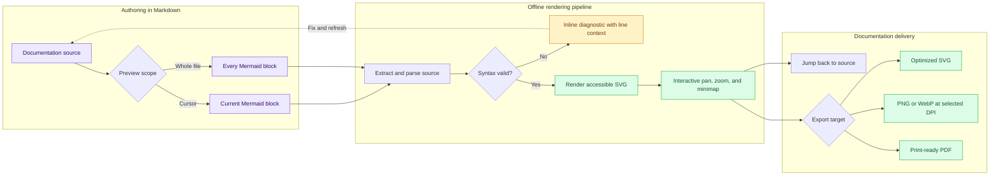
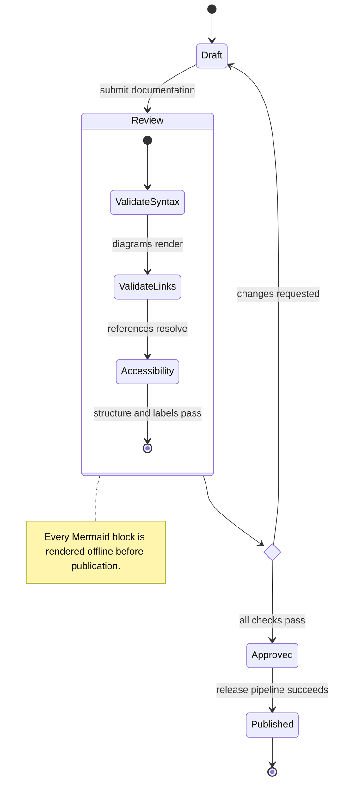

# Mermaid documentation example

This Markdown document contains several Mermaid diagrams for testing Mermaid
Preview Offline 1.1.0.

Place the cursor anywhere between the opening and closing fences, then run
**Mermaid Preview: Preview Block Under Cursor**. You can also run **Mermaid
Preview: Preview All Blocks in Document** or **Mermaid Preview: Export Document
with Diagram Images…**.

## Release gate example

The second block demonstrates that one document can combine different Mermaid
diagram families while keeping navigation and export tied to each source block.

Everything is rendered locally: the document and diagram source never leave
the workspace.

## Azure DevOps-style container

The third block exercises the `::: mermaid` form introduced in version 1.1.

::: mermaid
flowchart LR
  Wiki[Documentation container] --> Preview[Independent preview]
  Preview --> Resize[Resize and navigate]
:::
