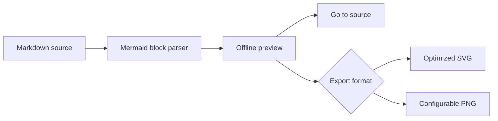

# Mermaid documentation example

This Markdown document contains a Mermaid diagram for testing Mermaid Preview
Offline 0.7.0.

Place the cursor anywhere between the opening and closing fences, then run
**Mermaid Preview: Preview Block Under Cursor**. You can also run **Mermaid
Preview: Preview All Blocks in Document** or **Mermaid Preview: Export Document
with Diagram Images…**.

Everything is rendered locally: the document and diagram source never leave
the workspace.
